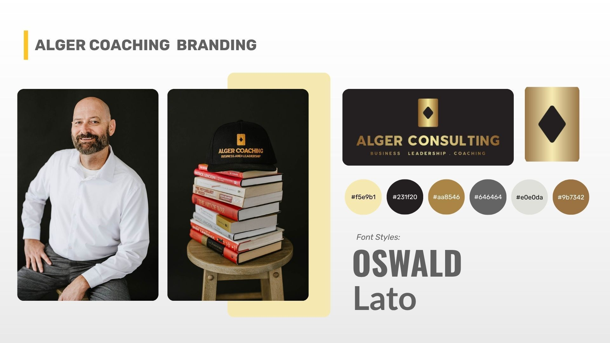
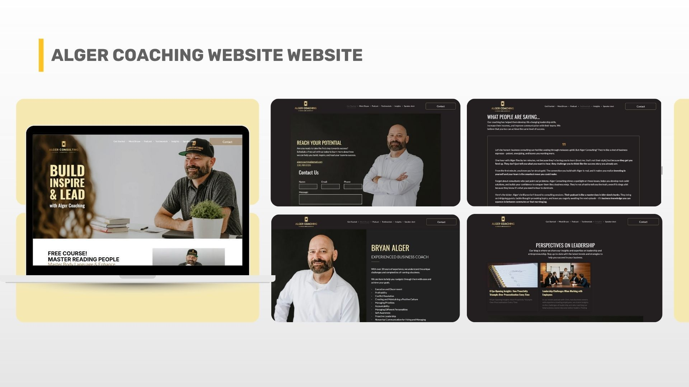
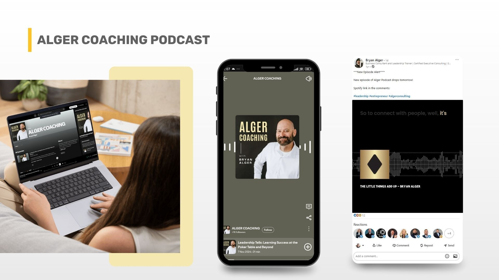
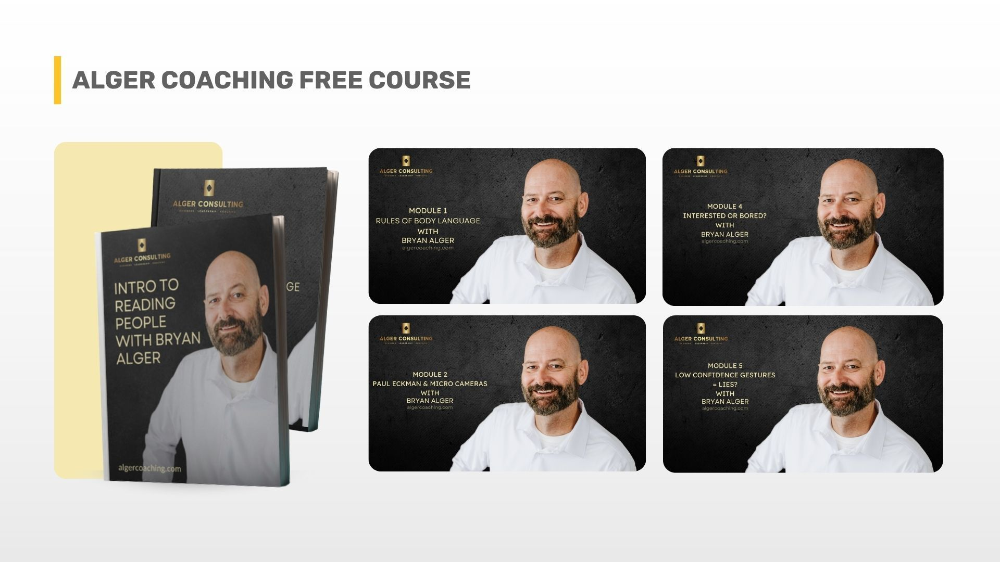

### Bryan had decades of business experience but had no clear path to show it. We helped him transform that experience into a consistent, confident personal brand, complete with a simple website, long-term marketing plan, and 18 months of steady podcasting that built trust and credibility over time.

## Intro

When Bryan Alger decided to step away from running a service business to start [Alger Consulting](https://www.algercoaching.com/), he wasn’t sure how to market himself. He had real expertise in leadership, team dynamics, and succession planning, but little confidence about how to present it. 

Bryan’s goal was to transition into coaching business leaders full-time.  
  

His past marketing attempts had been scattered and costly, and he didn’t want to waste money on another short-term fix.

That’s where Green Light Studio came in.

  

> "He wasn’t comfortable putting himself out there in a flashy way. So first, we focused on what to do, where to put his energy, and how to stay consistent over time."
>
> — Jake Mooney, Project Manager, Green Light Studio

## The Challenge

Bryan was starting a new business, with a new audience and a limited budget. He knew he wanted to help business owners become better leaders, but he needed to show his credibility fast.  
  

Despite the commendable nature of the project, he faced a significant challenge in establishing his brand and market positioning. He needed support that would serve as a sounding board, filtering ideas, and avoiding straying from a defined strategic path.  
  

> “This was more than a side project; it was his dream…if he had burned a bunch of money and gotten nothing in return, it’s possible he would have convinced himself it just wasn’t meant to work.”
>
> — Jake Mooney, Project Manager, Green Light Studio

If this didn’t work, Bryan risked giving up on the work he truly loved.  

## The Green Light Studio Solution

We approached the project as a long-term partnership, not a one-time campaign, built around three pillars: a clear marketing strategy, a simple website, and a consistent podcast.  

### 1\. The Marketing Strategy

From the start, we kept things calm and sustainable - a sensible strategy designed to build trust and credibility over time.

> “We focused on sustainable marketing, things that would work without requiring massive budgets.”
>
> — Jake Mooney, Project Manager, Green Light Studio

We helped Bryan:

*   Develop a podcast that helps him showcase his experience to potential coaching clients.  
      
    
*   Use his poker background to create an online course teaching communication and reading people, launching it on Udemy within days.  
      
    
*   Stay visible with monthly newsletters (one general, one for the pest control industry, where he already had relationships).  
      
    
*   Position his speaking engagements as key lead sources and include them on his site and in his emails.  
      
    

The strategy kept him building visibility for his brand and services in a calm, consistent way and exploring what really worked and what didn’t.  
  

### 2\. The Website

Bryan didn’t need a big, expensive site. He needed a website that is direct and manageable. We designed a one-page landing site on [Duda](https://www.duda.co/). It introduced his services, tone, and experience in a way that felt authentic.  
  

> “We kept it minimal, just one landing page, which kept the cost low and maintenance easy…we also guided him through a personal branding photo shoot, so people could look into his eyes and feel the warmth and empathy he brings.”
>
> — Jake Mooney, Project Manager, Green Light Studio

Even from across the world, our team helped him find a photographer and provided a creative brief to make sure the shots reflected his personality: credible, approachable, and grounded.  

### 3\. The Podcast

Once the strategy and site were live, we helped Bryan build his content engine, a [podcast](https://open.spotify.com/show/6aAvDuCPqllMVCsNrlGTw4?si=3fe80ea7e4944acc) focused on leadership and personal growth. He recorded episodes on his phone and home setup, and we handled the rest.

> “The main challenge was making sure the podcast looked and sounded as professional as the message being shared. We focused on cleaning up the sound, pacing, and flow so the message came through clearly without overcomplicating things.”
>
> — Richard Morse, Video Editor, Green Light Studio

For over 18 months, we handled post-production, editing, uploading, and creating social media graphics for each episode.  

> “The goal wasn’t to get a million listeners…It was to add credibility. When someone visits your site or Spotify and sees you’re actively speaking about your work, it changes perception.”
>
> — Jake Mooney, Project Manager, Green Light Studio

And it worked. The podcast became a pillar of his brand, proof that he was active, thoughtful, and deeply engaged with the work he teaches, and provided raw content that could be repurposed for social media and thought leadership articles on his blog.  

## The Results

Over the course of 18 months, Bryan:

*   Maintained a steady podcast presence, building authority and visibility in his niche.  
      
    
*   Launched a professional website that instantly improved credibility.  
      
    
*   Created and published his first online course, reaching hundreds of students.  
      
    

Grew his newsletter list and speaking engagements, expanding his reach within and beyond the pest control industry.  

> “We may not be a performance agency promising specific numbers, but we believe strongly in practical, sustainable marketing. If you have a budget that lets you stay in the game long enough, and a message people can connect with, that’s what builds lasting results.”
>
> — Jake Mooney, Project Manager, Green Light Studio

But beyond metrics, the biggest result was confidence. Bryan went from hesitant and uncertain to clear, consistent, and confident without overspending or burning out.  
  

> “At Green Light Studio, the team is kind, helpful, and knowledgeable, and genuinely fun to talk with. They consistently deliver great work, earning my trust at a high level. I would, and have recommended them to others.“
>
> — Bryan Alger, Alger Consulting

## Final Thoughts

For us, this project was a perfect example of why we do what we do: helping good people build meaningful brands in a calm, practical way.

  

Bryan's focus had to be on a plan that genuinely worked for him, and we delivered.

If you’re building a personal brand or coaching business and want to stay consistent without burning out, let’s talk. Green Light Studio can help you create something sustainable so you can focus on the work you actually love.
