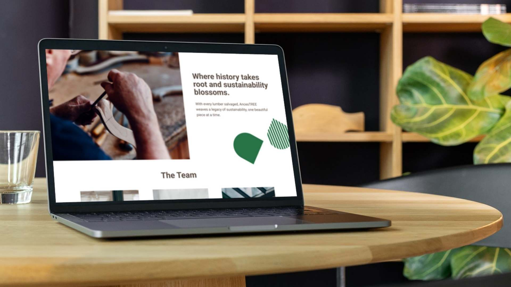
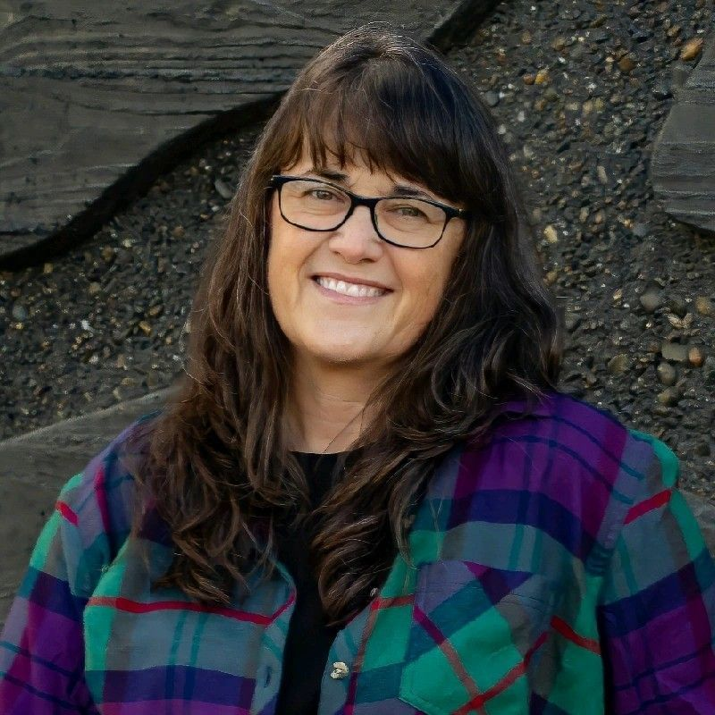
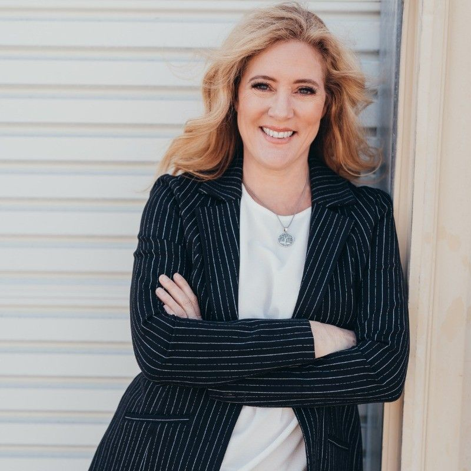

**Client:** AncesTREE® 

**Industry:** Urban Lumber, Salvaged, and Reclaimed Wood Marketplace 

**Project:** Website Landing Page 

**Objective:** To create a user-friendly, visually appealing landing page that effectively promotes the AncesTREE® app and aligns with the client's brand identity. 

  

AncesTREE® is all about making it easier for urban lumber businesses to manage inventory and connect with buyers.

  

They had a powerful app ready to go, but they needed a landing page that introduced their platform, kept users engaged, and felt like a seamless extension of their brand.

  

And they needed it fast.

> Working with Jake and the team at Green Light Studio was a wonderful experience.They encouraged our involvement every step of the way and we were able to create a landing page that met all of or needs today and will grow with us into tomorrow.
>
> — Julie Stelman

> Green Light Studio exceeded our expectations in creating and launching the AncesTREE webpage. They skillfully handled the technical implementation, ensuring a seamless and polished result.Jake’s deep understanding of the wood industry was key to capturing and executing our vision.We’re thrilled with the outcome and highly recommend their team for projects requiring industry insight and expert execution.
>
> — Jennifer Alger

## What They Needed

The goal was simple: create a landing page that was easy to use, visually appealing, and clearly explained what AncesTREE® was all about.

  

That meant:

*   **Engaging design** – Something that would grab visitors’ attention and make them want to learn more.
*   **Clear messaging** – No fluff, just a straightforward explanation of how the app helps users.
*   **Sustainability-inspired aesthetics** – A design that reflects AncesTREE®’s mission.
*   **Strong calls to action** – Encouraging visitors to sign up, explore features, and get involved.
*   **Brand consistency** – Making sure the landing page looked and felt like an extension of the app.

  

## Our Approach

  

### Keeping It Simple and Scalable

We chose Duda as the platform because it gave AncesTREE® an affordable, easy-to-update site—important since the app was still evolving.

### Designing for Clarity and Impact

The layout needed to make the app’s benefits obvious at a glance.

  

We focused on a clean structure, sustainable-themed visuals, and strong, well-placed CTAs to drive engagement.

### Rolling With the Changes

Like any fast-moving project, things shifted along the way.

  

AncesTREE® needed some last-minute content tweaks, and we adapted quickly, making sure everything stayed polished and aligned with their messaging.

  

## The Outcome

*   **A cohesive brand experience** – The landing page seamlessly matched AncesTREE®’s existing identity.
*   **A future-proof solution** – Built on a platform they could easily update as the app grew.
*   **Better user engagement** – Visitors could quickly understand the app’s value and take action.

  

## Wrapping It Up

This project was all about speed, efficiency, and making sure AncesTREE® had a solid digital presence before launch.

  

Now, they’ve got a landing page that not only introduces their app but can grow with them as they expand.
