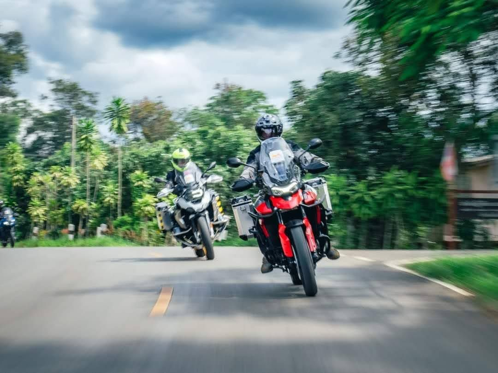
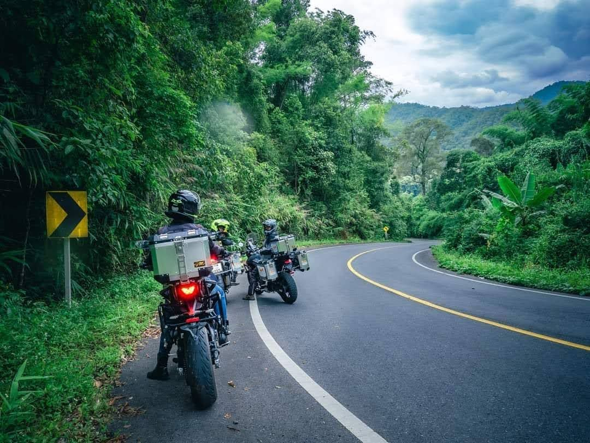
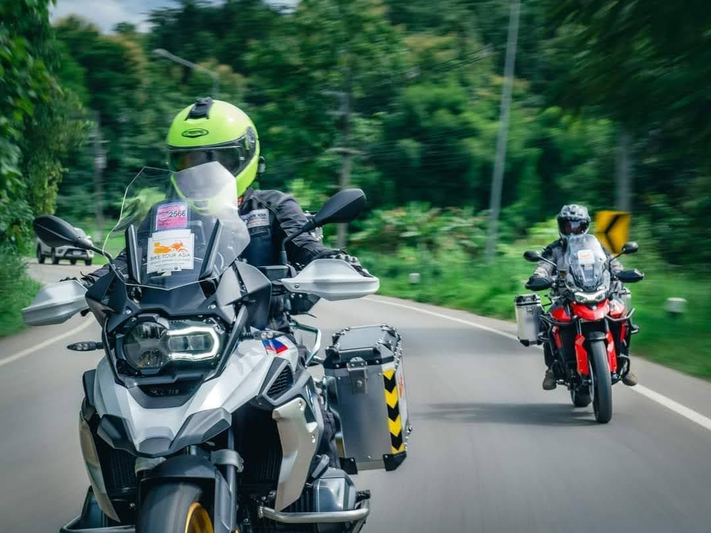
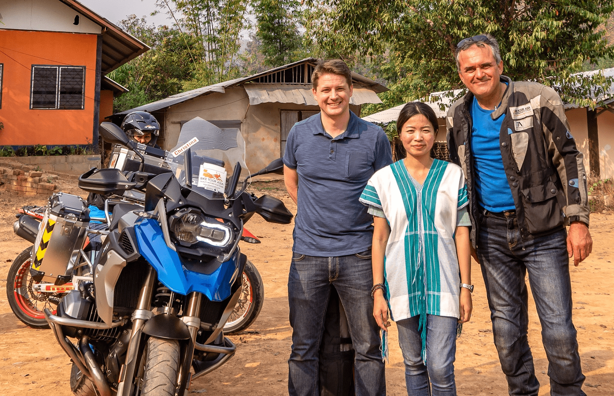
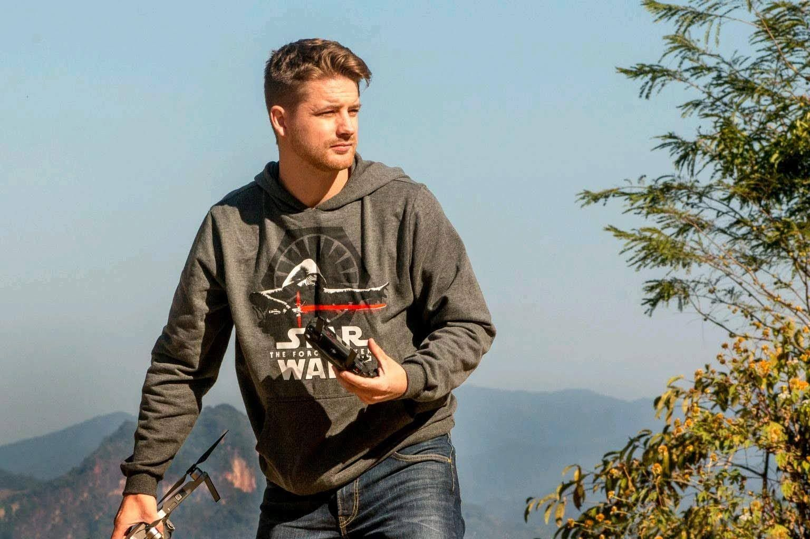
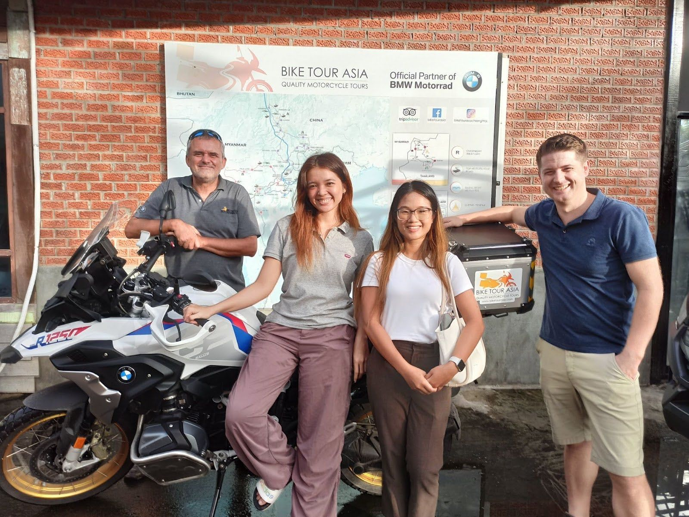
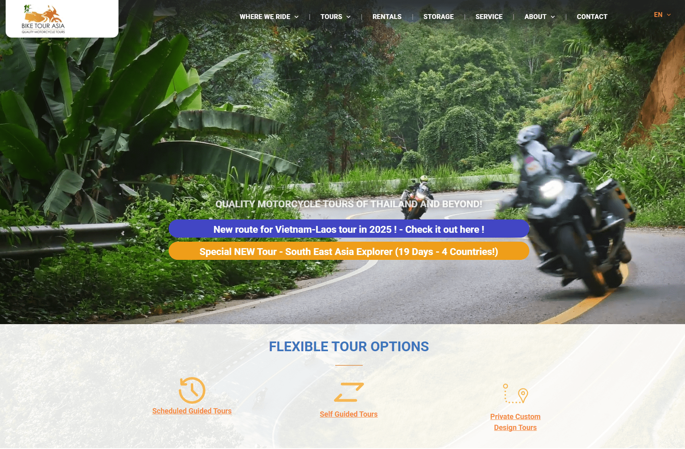
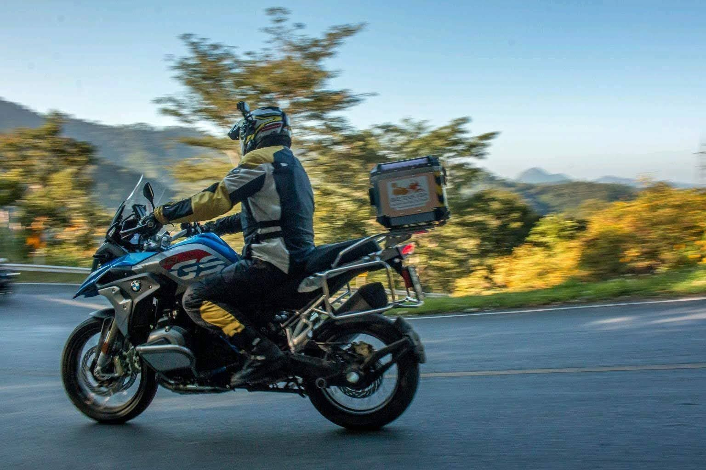

### A Flexible, Long-Term Marketing Partnership

#### **Client Overview**

*   **Company**: Bike Tour Asia
*   **Industry**: Motorcycle
*   **Key Contact**: Daniel Senicar, Partner
*   **Project Duration**: December 2019 – Ongoing

### **The Challenge: A Business at a Crossroads**

Bike Tour Asia (BTA) faced a unique set of challenges. Their website was outdated and vulnerable, their marketing efforts lacked focus, and their video production needs were constrained by budget. On top of this, the global tourism market was marked by fluctuations over five years, requiring a marketing partner that could adapt to both opportunities and setbacks.

Bike Tour Asia sought a partner who could deliver not just marketing materials but also strategic insights that would help them navigate the ups and downs of the tourism industry with confidence.  

> “We are always wrestling with how best to handle marketing strategies and try to improve our inquiry level of motorcycle tours. So, we asked Jake from Green Light Studio to put together some ideas and walk us through the suggestions.”
>
> — Scott Stoodley

* * *

### **The Green Light Studio Approach: Strategy Before Execution**

  

Over five years, Green Light Studio (GLS) partnered with Bike Tour Asia on an as-needed basis, offering consistent value tailored to the business’s changing circumstances. Green Light Studio conducted a marketing audit to identify effective strategies, eliminated wasteful efforts, and established a sustainable marketing foundation designed to grow momentum steadily over time.

This flexibility enabled Bike Tour Asia to stay agile while maintaining focus on long-term success.  

> Jake and his team came up with a wide variety of ways to look at how to reach our potential customers and stressed that we need to be focused on a long-term approach to our efforts and budgets. The best part of Green Light’s approach is that we are able to cover some of the actions with internal resources while contracting out to them for some of the more specific items where their networks and experience add value and efficiency to the task.
>
> — Scott Stoodley

* * *

### **Key Projects**  

**Marketing Audit and Strategy Reboot**  
Green Light Studio started with an in-depth marketing audit, uncovering what was working and what wasn’t. This informed a long-term marketing strategy that balanced sustainability with Bike Tour Asia’s internal capacity.

**Deliverables:**  

*   Clear recommendations for high-impact marketing tactics.
*   Long-term strategies designed to build momentum and avoid shortcuts.
*   Practical action plans that Bike Tour Asia could implement with their team and outsource selectively.  
    

**Website Revamp**  
Green Light Studio rebuilt Bike Tour Asia’s outdated website, creating a modern, secure, and fast-loading platform. The new site offered an improved user experience, easier maintenance, and greater digital visibility.

**Impact:**  

*   Enhanced user engagement and seamless navigation.
*   Reliable security and easier updates for administrators.  
    

**Video Production on a Budget**

To bring Bike Tour Asia’s tours to life, Green Light Studio produced a range of compelling videos. By blending their own footage with materials provided byBike Tour Asia’s team, Green Light Studio ensured high-quality results while staying within budget.  

**Notable Videos made by Green Light Studio for BTA:**

*   [Amazing Land of Lanna](https://www.youtube.com/watch?v=BE51jepEO_0) | 10-Day BMW Motorcycle Tour of Thailand (18K views).
*   [Dual Tour](https://www.youtube.com/watch?v=XWTDq4g9pZE) | Off-Road Motorcycle Tour in Thailand (3.6K views).
*   [Charity Ride 2021](https://www.youtube.com/watch?v=Wsx06whLwcU) | Mae Hong Son Loop (2.7K views).

These videos showcased the stunning landscapes and cultural richness of Southeast Asia, reinforcing Bike Tour Asia’s position as a leader in motorcycle tours.  

**Mentorship and Internal Team Empowerment**

Green Light Studio didn’t just deliver materials—they empowered Bike Tour Asia’s team with the skills and guidance to take on parts of the marketing strategy themselves. By mentoring staff, Green Light Studio ensured that Bike Tour Asia could remain resilient and self-sufficient even during uncertain times.  

> They include time to mentor us with the actions that we do take on ourselves so our own staff are always improving. Jake has always been accessible for a quick chat when stuck on a specific issue, and that’s invaluable to a smaller operation such as ours.
>
> — Scott Stoodley

* * *

### **Flexibility Through Global Shifts**  

Over five years, Bike Tour Asia weathered the highs and lows of the global tourism market. Throughout this period, Green Light Studio remained a flexible partner, providing support only when needed. Whether addressing immediate challenges or crafting strategies for growth, Green Light Studio adapted its services to Bike Tour Asia’s evolving needs.

  

* * *

### **Results and Impact**  

**Tangible Outcomes:**

*   A comprehensive marketing reboot that prioritized sustainable growth.
*   A modern, secure website that enhanced customer engagement.
*   Video content that reached tens of thousands of viewers, sparking interest in Bike Tour Asia’s tours.  
    

**Intangible Benefits:**

*   An empowered internal team equipped with long-term marketing skills.
*   A trusted partnership with Green Light Studio, built on adaptability and collaboration.  
    

> We definitely consider Jake and Green Light a ‘partner’ in our marketing efforts, not just a service provider.
>
> — Scott Doodley

* * *

### **Conclusion**  

Green Light Studio’s partnership with Bike Tour Asia highlights the power of sustainable, flexible marketing. By providing value on an as-needed basis and helping Bike Tour Asia adapt to industry fluctuations, Green Light Studio ensured that the business remained resilient and ready for growth.

This case study demonstrates that with the right partner, even in a dynamic market, businesses can thrive by investing in thoughtful, long-term strategies.
