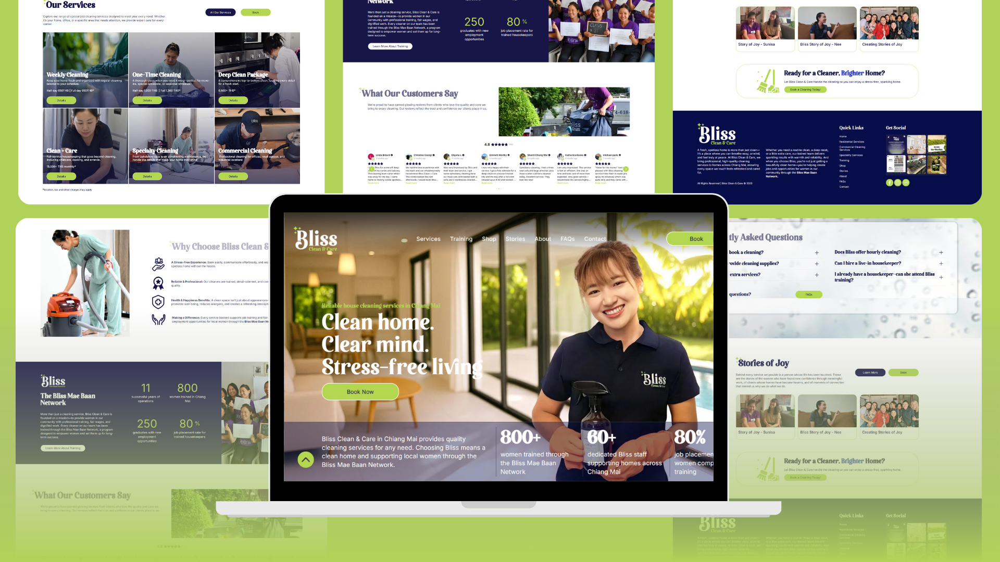
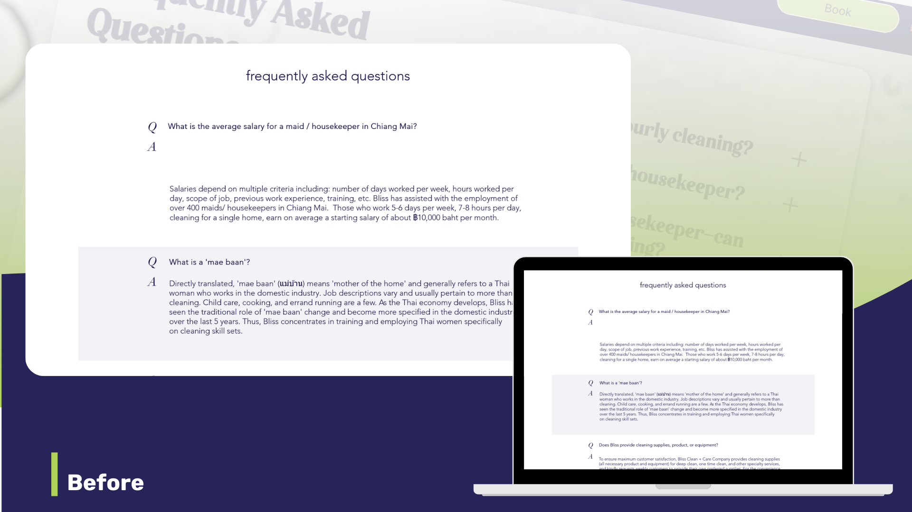
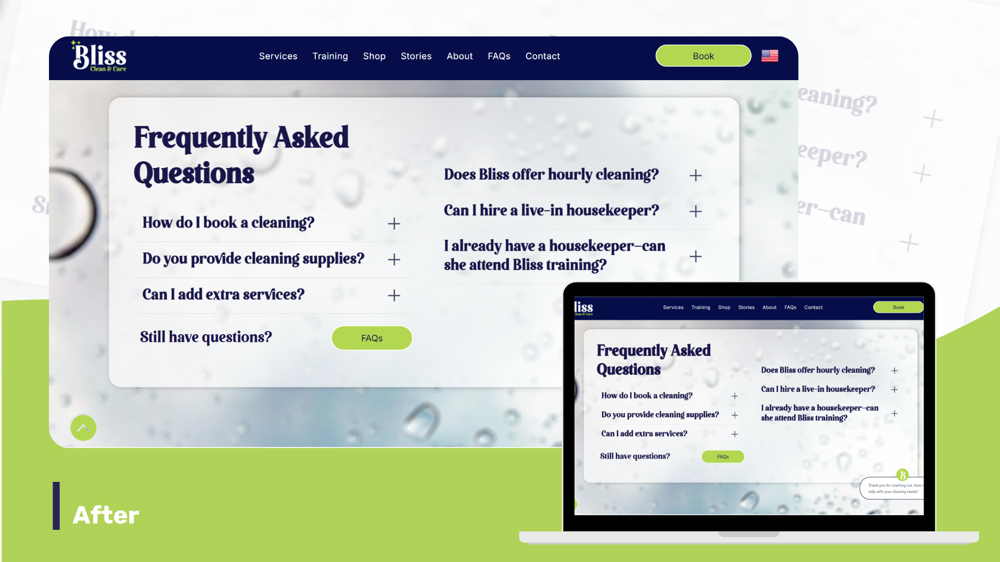
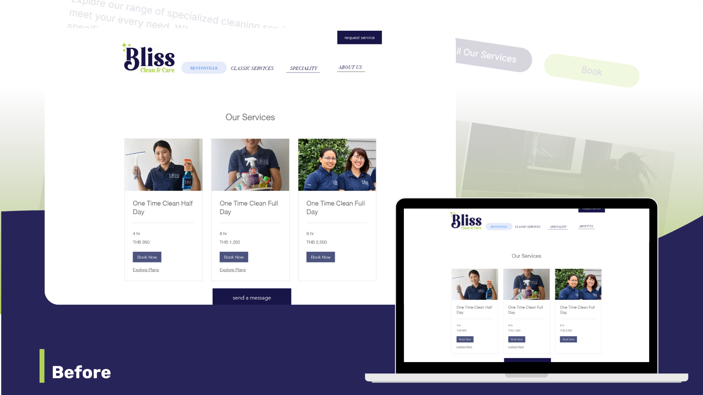
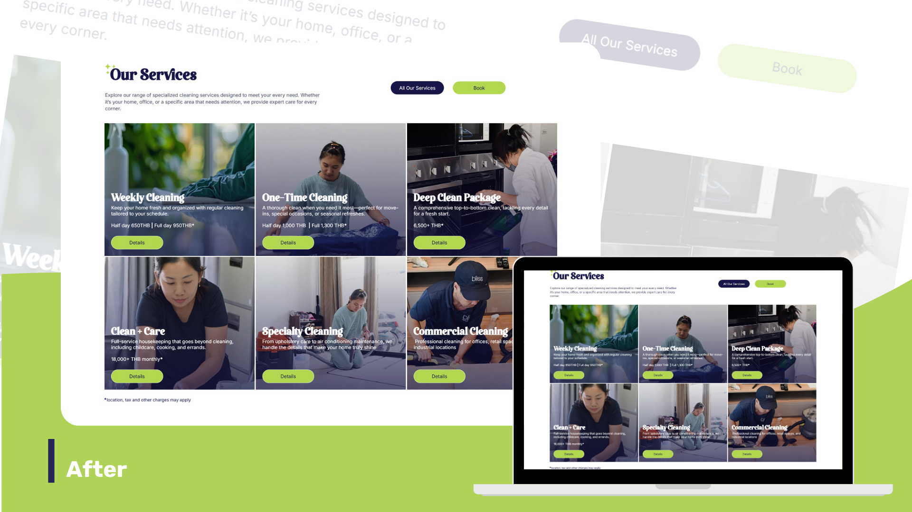
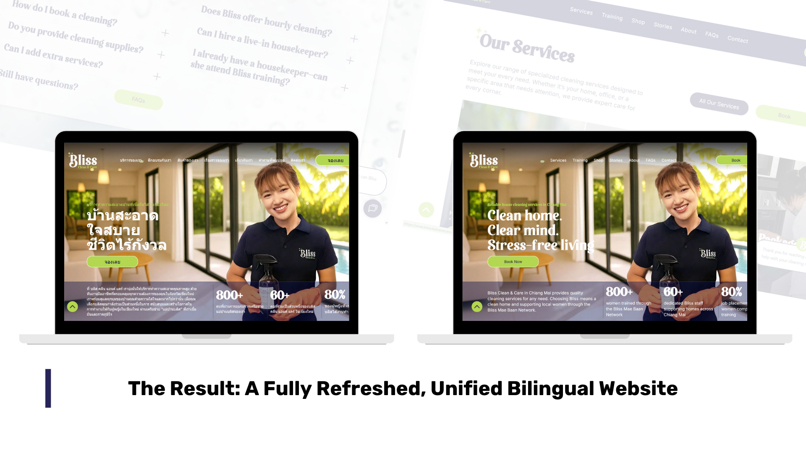

Bliss had two outdated websites, a broken WordPress and Wix build, and poor Thai SEO. We guided them through a collaborative, bilingual rebuild and joining platforms, simplifying updates, and making their social mission shine.

## Intro

[Bliss Clean & Care and the Bliss Mae Baan Network](https://www.blisscleanandcare.com/) had the right story to tell:  a cleaning service that doubles as a social enterprise training local Thai women. 

  

The problem? Their online presence didn’t reflect that. 

  

Having two separate websites (one barely working), their brand was fragmented, their search visibility in Thai was poor, and it was holding them back from showcasing their capabilities, services, and making it easy for prospective clients to move forward..

  

They needed more than just a new site. They needed a structured process to work through the big picture and a partner to walk them through it.  

## The Challenge

The old site was broken on WordPress and “barely navigable,” as Jake put it. Even so, it ranked number one in English search results for cleaning in their area. But in Thai, they were nearly invisible.

  

On top of that, they were running two different websites for the business and the non-profit related organization. This meant duplicate content, confusing branding, and twice the amount of admin work. Most importantly, it didn’t clearly connect Bliss Clean & Care’s services with the Mae Baan Network’s mission of empowering women through training and fair employment.  

## The Green Light Studio Solution

### Deep Discovery

> “We had very long but very fruitful discovery meetings,” Jake explained. “We went through every service, every FAQ, recorded everything we talked about so we could reference it in detail later, and gathered all their existing service and company documentation.”

  
These sessions provided us with a comprehensive understanding of what Bliss needed, not just technically, but also in terms of retelling their story and ensuring that services were fully described.  
  

Before After

### Research & SEO Foundation

Jake took those notes and backed them with SEO analysis:  

> “We performed a baseline SEO audit, built the page structure, and used AI tools alongside discovery notes to efficiently draft content. It was a very collaborative process, as the clients were also highly involved."
>
> — Jake Mooney, Green Light Studio

He also added that bilingual SEO was critical:  

> “The old site wasn’t performing in Thai at all. We built tailored keywords and meta descriptions for both English and Thai.”

Before After

### Design & Build  

With content locked, we designed a fresh, service-focused site structure that supported booking conversions and promoted the Mae Baan Network at the same time. 

  

Bliss helped us from their side by providing images and detailed input, while we handled the technical build on Duda. Duda was a clear choice as it simply helps their team by providing a platform to easily update without the usual maintenance costs for a WordPress website.

###   
Step-by-Step Milestones  

The project followed a clearly staged process:

*   Workshop
*   SEO Audit
*   Content creation
*   UI design & media gathering
*   English site build
*   Thai build
*   Redirects and DNS
*   Launch

  

Payments were tied to approvals, giving structure and transparency at each stage.  

## The Results

The outcome was a unified bilingual website that finally did justice to both Bliss Clean & Care’s services and the Mae Baan Network’s mission.

  

*   One platform instead of two, reducing admin headaches.  
      
    
*   Bilingual SEO that provided a baseline for building visibility in Thai language searches.  
      
    
*   Integration of HubSpot form for service requests and a reviews widget for social proof.  
      
    
*   A clean design aligned with Bliss’s branding and easy for their team to manage moving forward.

  

Jake summed it up well: “We delivered a fresh design that matched their brand, on a platform they can update themselves. It’s cost-effective and sustainable."  

## Final Thoughts

This project wasn’t just about fixing a broken site. It was about guiding Bliss through the steps, keeping costs in check, and making sure their social mission was front and center.

  

And as Jake put it: 

> “We’re proud we exceeded expectations, handling the language complexities and delivered a persuasive site that promotes both services and mission.”

That’s how we approach every project at Green Light Studio: structured, collaborative, and sustainable. If your business needs the same kind of brand reset, let’s talk.
