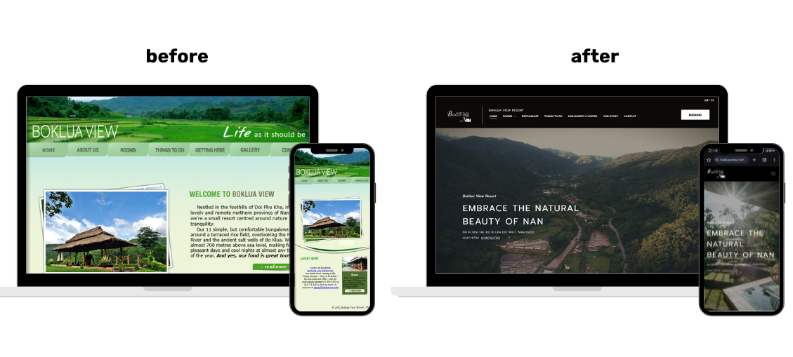
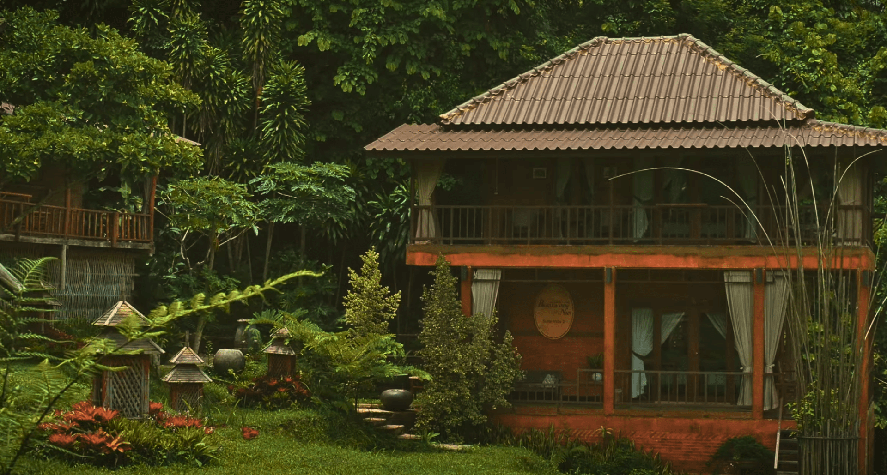
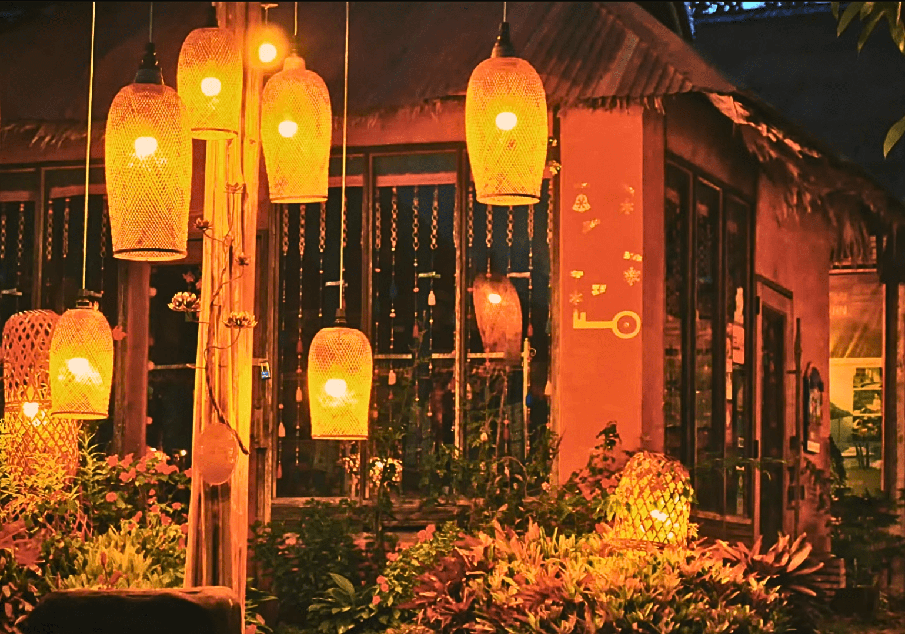
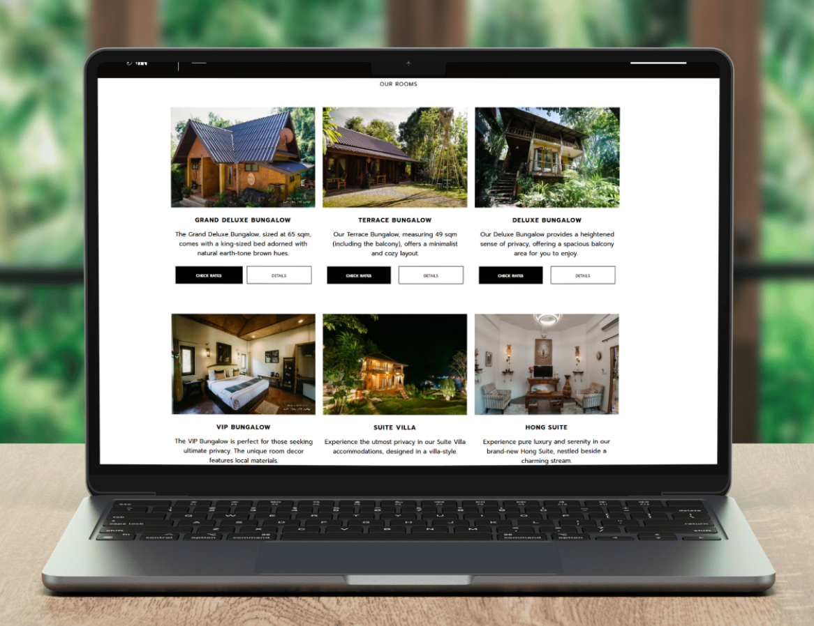
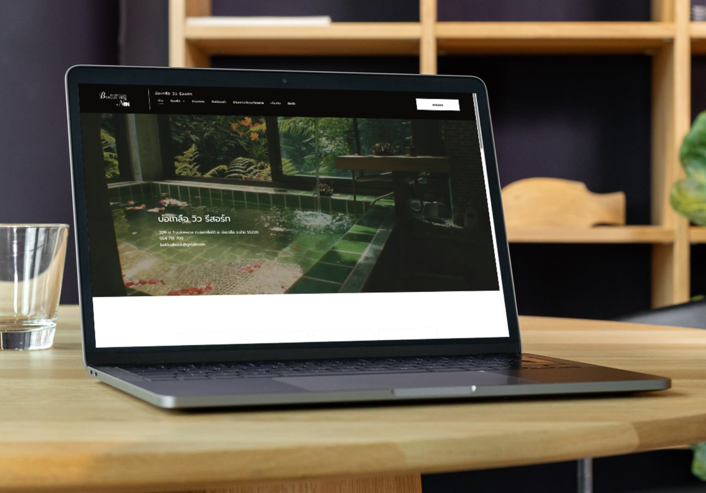
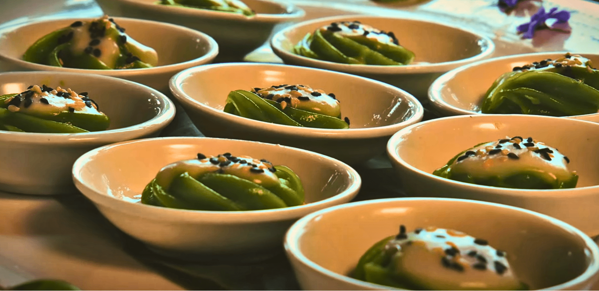
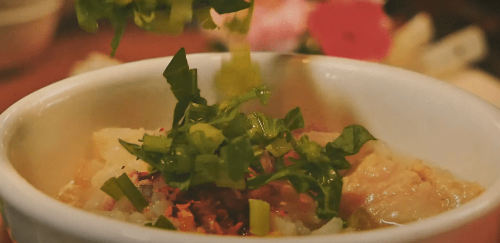
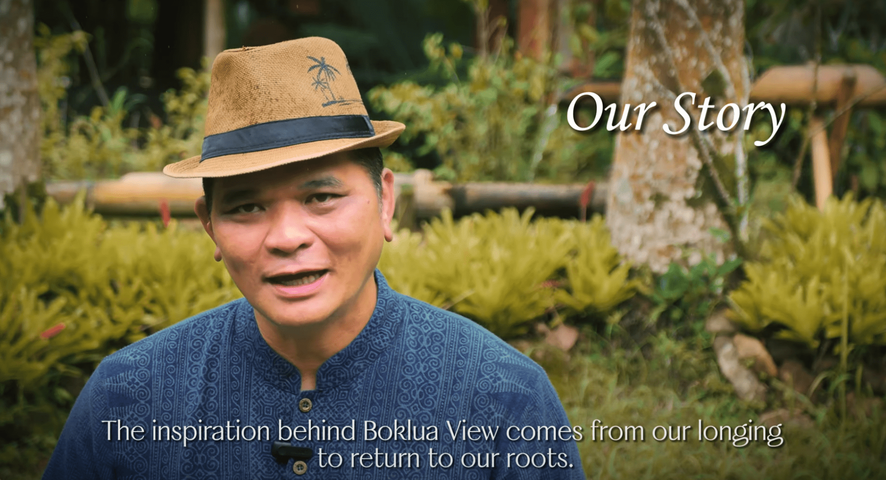

### Outdated Website, Missed Bookings: How We Helped a Thai Mountain Resort Attract Global Travelers Again

Peter’s resort had heart but the online presence had grown sorely outdated. We helped him rebuild a bilingual website that reflected the total experience their resort offered and made it easy to browse rooms and make a booking.  

### **The Challenge**  

Boklua View Resort had all the elements of a memorable guest experience: mountain air, local food, hand-built bungalows, and a peaceful pace. What it didn’t have was a modern way to present itself online.

  

The resort's original website hadn’t been updated since the business was first established. It wasn’t mobile-friendly, didn’t function well in Thai or English, and didn’t include any recent photos of the property or its newest offerings—like the on-site bakery and high-end suites. 

> Our website had not been redone since the establishment of the business many years ago. We needed a modern, user-friendly site in both Thai and English, with an emphasis on quality photography and content.We had relied on our Facebook page rather than our website, but this didn’t effectively tap into a growing international market and also didn’t adequately showcase what we had to offer.
>
> — -Peter (Client)

Even more, the site failed to reflect the eco-conscious, community-rooted values that had always guided the business.

  

Without a strong online presence, Boklua View risked losing bookings and falling behind newer competitors who were investing in digital marketing. As tourism in Northern Thailand began to grow again after the pandemic, the moment to act had arrived.  

### **Our Approach**  

Green Light Studio was brought in to lead a full redesign of the website and create a clear, bilingual experience for visitors.

> They didn’t need a complex website. They needed a simple website that represented their guest experience.
>
> — Jacob Mooney

Here’s how we tackled the project:

**1\. Clear Planning, Start to Finish**

We worked closely with Peter and the team to map out what content to keep, what needed updating, and what should be archived.

> Green Light Studio was extremely professional and efficient to work with and was responsive to our own thoughts and suggestions.
>
> — - Peter

We prioritized a clean, easy-to-use structure and began building a Thai-English site from the ground up.

**2\. Local + International Collaboration**  

Our team in Chiang Mai includes both Thai and international creatives, which allowed us to write, edit, and design in both languages to match Boklua’s brand. We also visited the resort in person to better understand the space and capture what makes it unique.

> This wasn’t just about building a website,” said content writer Mild Ketsaraphon. “It was about helping them tell their story—especially to Thai travelers who hadn’t yet discovered the place.
>
> — Mild Ketsaraphon

> We loved that it was a very remote resort with over 20 years of history. Being able to manage the whole thing—photos, writing, the web build, and more—was really rewarding.
>
> — Jacob Mooney

**3\. Content That Speaks for Itself**  

To support the new site, Green Light Studio captured updated photos and produced a short video showcasing the resort’s natural beauty and founder’s story.  

These elements were designed to help guests understand why Boklua View is different—and why it’s worth the trip.

  

As Richard, who led the video project, noted:  

> They didn’t have a video that really showed what they had to offer all in one package. Once we got the new shots and video, it all just came together. You could see the value of the place.

### **Results**

The result is a clean, bilingual website that works just as well on mobile phones as it does on desktops. It reflects the premium, eco-friendly experience the resort offers—and gives guests a much better sense of what to expect before they arrive.

  

Peter, the resort’s representative, summed it up clearly:  

> The revised website is proving far more effective than our Facebook page, especially in the international market. Green Light Studio was extremely professional and responsive to our suggestions. The inclusion of a highly professional video was a feature, complementing the photographs and text.

### **Project Highlights:**

*   Fully mobile, Thai-English website redesign
*   Updated content and visuals that better reflect the guest experience
*   In-person collaboration to align digital presence with on-site reality
*   Ongoing updates and support post-launch  
    

### **A Long-Term Fit**

Boklua View Resort didn’t just need a new website—they needed a partner who understood how to bring their vision online without overcomplicating the process.  

> We knew they didn’t want a high-maintenance site, so we chose a platform that was simple, sustainable, and easy for their team to manage long-term.
>
> — Mild Kestaraphon

Now, with a modern, well-organized website in place, Boklua View is better equipped to connect with travelers seeking something personal, peaceful, and authentic.  

> “It’s one of our best projects. The final product really reflects the place itself—and that’s the most satisfying part.”
>
> — Richard
