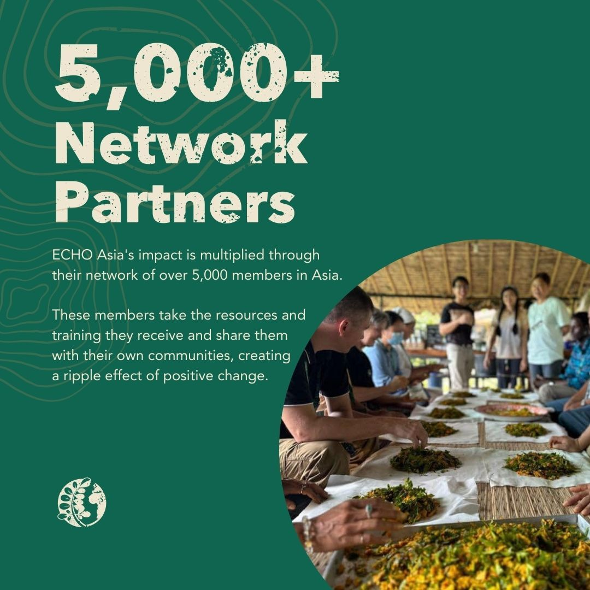
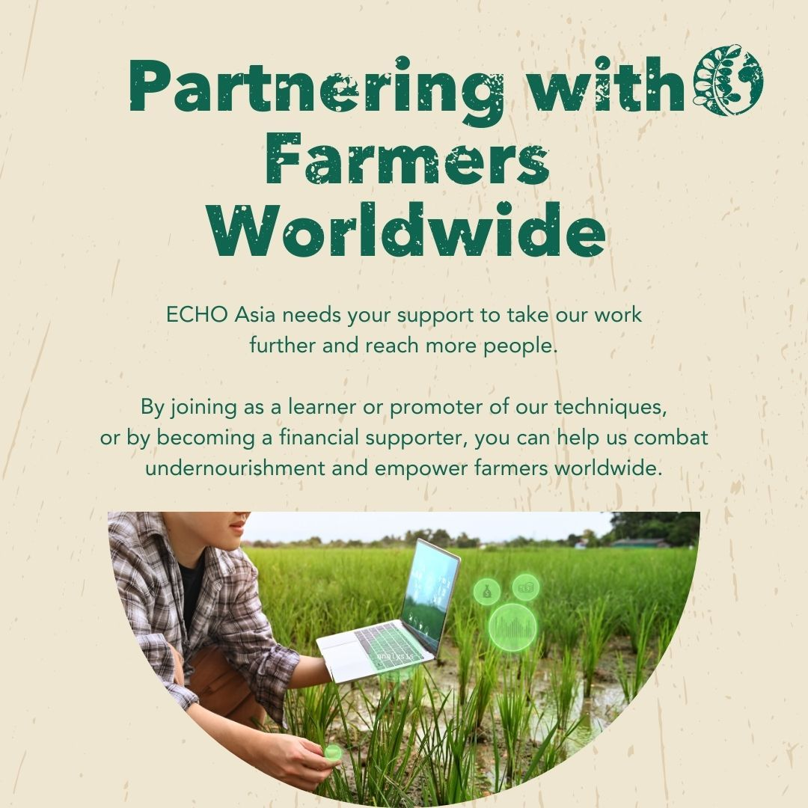
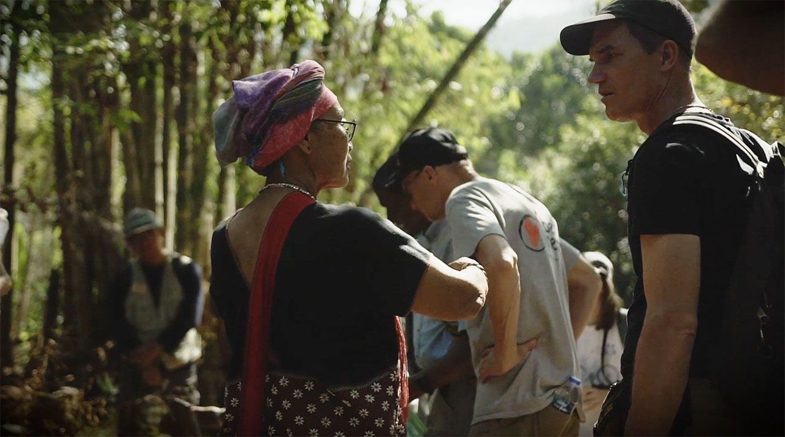
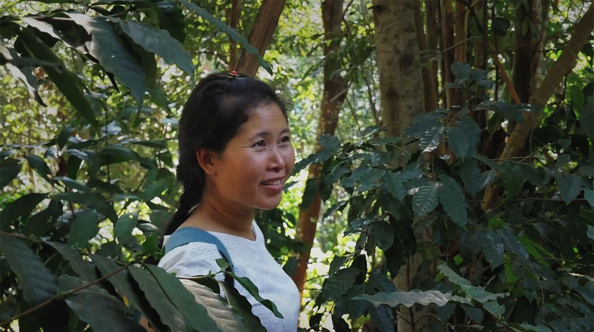
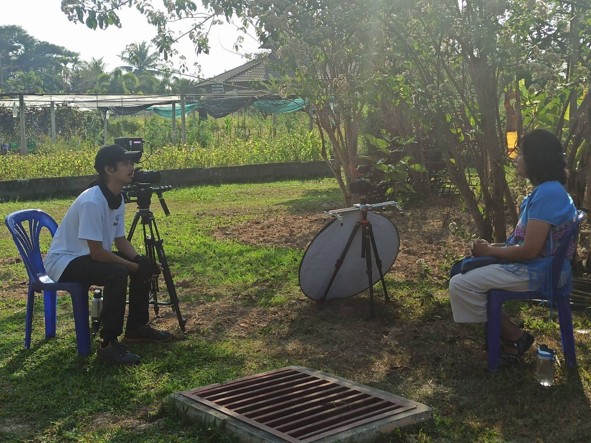
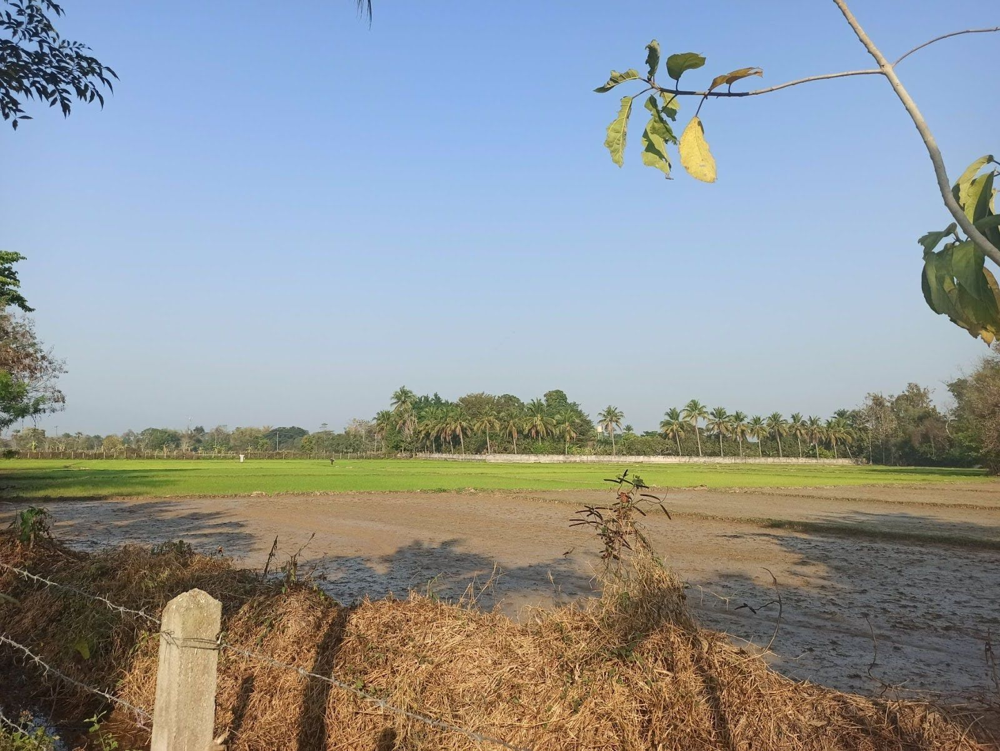
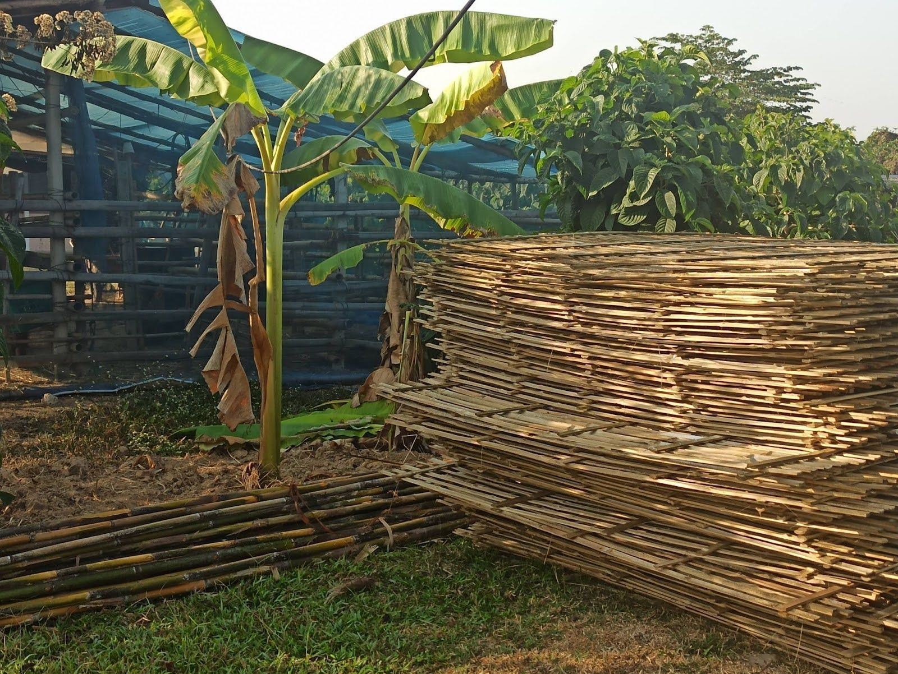
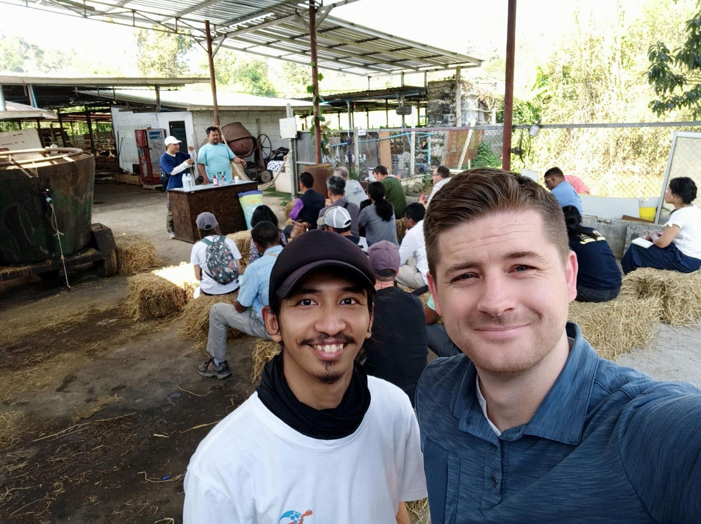
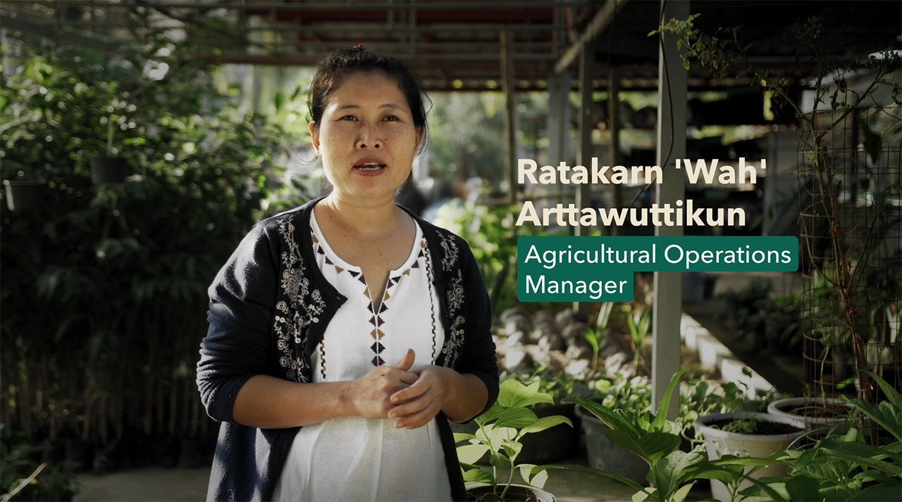
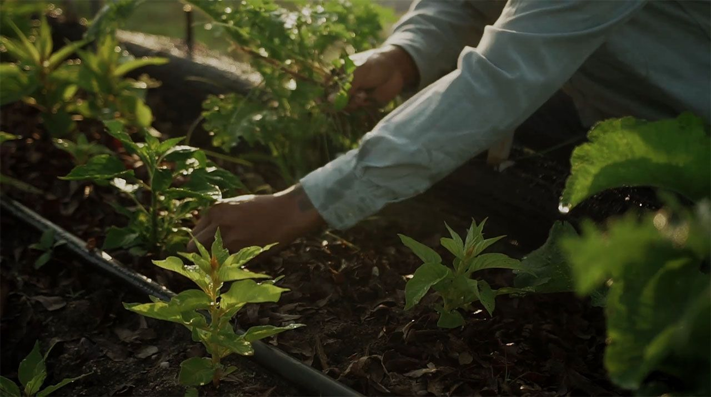

### How ECHO Used Video to Strengthen Donor Engagement

#### **Client Overview**

*   **Client**: ECHO Asia
*   **Industry**: International Agricultural Development and Community Support
*   **Project**: "About Us" Video for ECHO Asia
*   **Objective**: To create an authentic, impactful video showcasing ECHO’s unique work in Southeast Asia, aimed at donor relations and fundraising.  
    

ECHO works globally to equip small-scale farmers with sustainable agricultural techniques, providing knowledge, seeds, and training to combat food insecurity. While ECHO operates on a large scale, much of its impact is achieved through partnerships with local organizations that extend their reach into underserved communities. For their Southeast Asia branch, ECHO sought a video that would highlight the unique partnership model they use to share agricultural knowledge, focusing on the perspectives of the individuals and communities they serve.  

### **Project Background**

  

**ECHO faced a challenge:** they needed a way to communicate the depth and breadth of their mission in Southeast Asia to donors and potential partners, but their work in the region is less about direct aid and more about empowering other organizations to extend ECHO's reach. The goal was to communicate this collaborative, resource-sharing model in a way that felt authentic and compelling to potential supporters.

Green Light Studio was tasked with producing an “About Us” video that captured ECHO’s community-centered approach. ECHO needed the video on a tight schedule to coincide with upcoming donor events and regional weather constraints, making efficient production and editing essential.

### **Goals and Expectations**

ECHO's broader objectives guided the video's purpose:  

   1. **Expand Knowledge Sharing**

Illustrate how ECHO shares technical resources both on-site and through their digital platform, ECHOcommunity.org.

   2. **Promote Sustainable Agriculture**

Showcase how ECHO equips communities with sustainable agricultural practices that enhance food security.

   3. **Increase Global Impact** 

Highlight ECHO’s regional training centers and their role in advancing agricultural knowledge.

   4. **Foster Community Connections**

Emphasize ECHO’s collaborative model, where they work alongside NGOs, local organizations, and farmers to multiply their impact.

### Green Light Studio's Approach

*   **Authentic Storytelling from Beneficiaries**

Green Light Studio chose a beneficiary-led narrative over a traditional, top-down organizational focus. Instead of spotlighting ECHO’s internal operations, the video featured personal stories from individuals and communities directly impacted by ECHO’s work. This approach allowed the video to convey ECHO’s value through relatable, real-world success stories that emotionally resonate with viewers.

  

*   **Scaled-Down Production**

Working with a tight timeline and budget, we prioritized essential shots and captured footage on location. The team accompanied ECHO to various sites around Chiang Mai, including training on biochar production and water filtration, to show ECHO’s work in action. This on-the-ground perspective reinforced the grassroots nature of ECHO’s mission.

  

*   **Production Challenges**

Due to last-minute health challenges, some ECHO and GLS team members were unavailable for parts of the shoot. Green Light Studio used innovative editing to maintain continuity in the video narrative without requiring reshoots, allowing us to keep the project on budget and schedule.  

### **Challenges and Solutions**

*   **Health and Logistical Issues:** Illness affected both ECHO and Green Light Studio team members, requiring flexibility in team roles and responsibilities. The team adapted by reshuffling tasks and moving forward with a revised plan, ensuring filming remained on track.

  

*   **Transportation and Remote Locations:** The rural settings required precise planning to coordinate logistics and minimize disruptions to ECHO’s ongoing training activities. The team managed this by working with ECHO to create a detailed shot list and collaborating closely with ECHO staff to optimize timing.

  

*   **Flexible Content Creation:** ECHO’s precise narrative required real-time adjustments to the storyline and content focus. Green Light Studio worked closely with ECHO to adapt content as the shoot progressed, ensuring alignment with their mission while keeping production efficient.

### **Outcome**

The final video achieved ECHO’s goals by blending personal stories with on-the-ground footage to create an authentic, compelling portrayal of their work. Key outcomes included:  

*   **Increased Donor Engagement:** The video offered a clear, relatable view of ECHO’s impact, enhancing donor understanding of ECHO’s mission and encouraging continued support.
*   **Strengthened Brand Trust:** By focusing on the experiences of beneficiaries, the video underscored ECHO’s community-centered values, strengthening viewer trust and appreciation for their approach.
*   **Budget and Timeline Compliance:** Despite logistical challenges, Green Light Studio delivered the project on schedule and within budget, thanks to adaptive strategies and close client collaboration.

Working with ECHO allowed Green Light Studio to bring a meaningful story to life. By focusing on the voices of those benefiting from ECHO’s resources and support, we were able to authentically showcase ECHO’s unique approach to agricultural development and community empowerment. The success of this project has led to further collaborations with ECHO, reinforcing our commitment to creating impactful, mission-driven content.  

### **Testimonial**  

> Working through Green Light Studio allows us to put our staff resources where they are most needed while utilizing the equipment and experience of a professional studio. The results speak for themselves!
>
> — Patrick Trail

* * *

