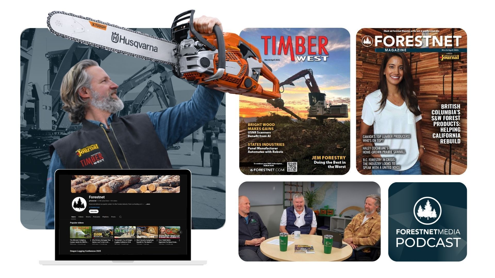
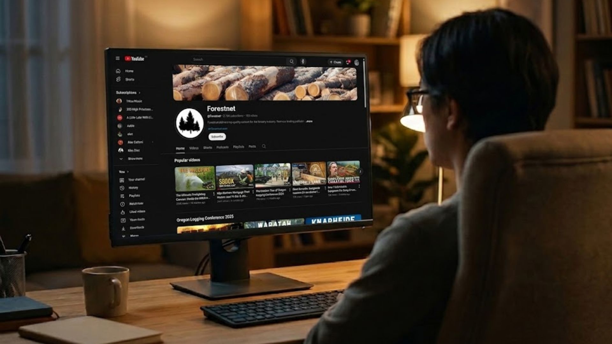
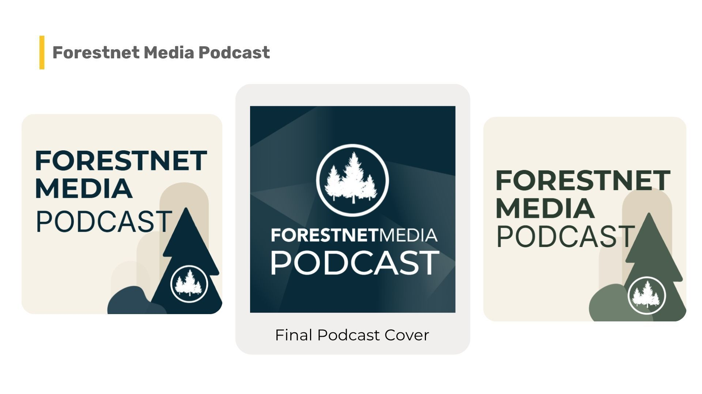
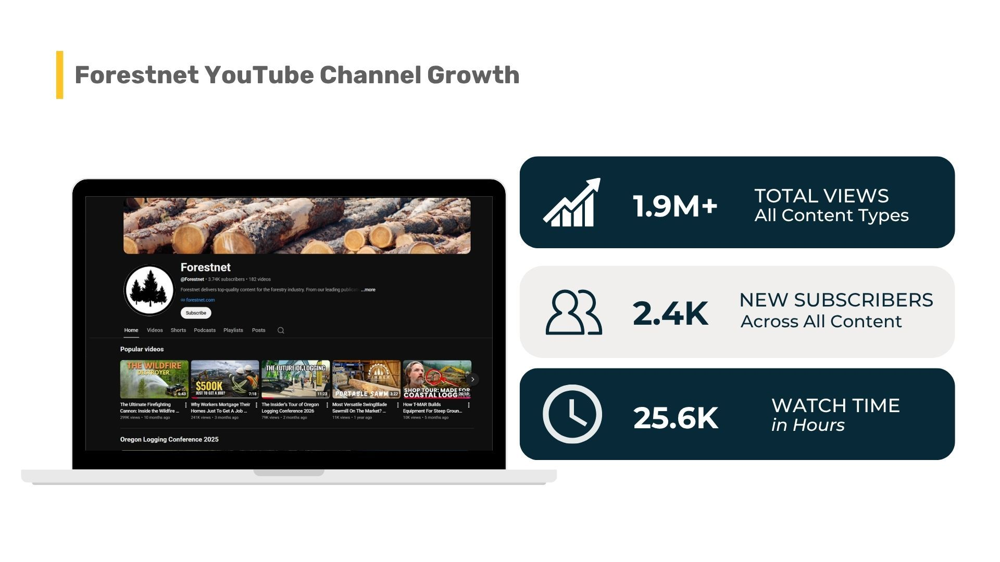
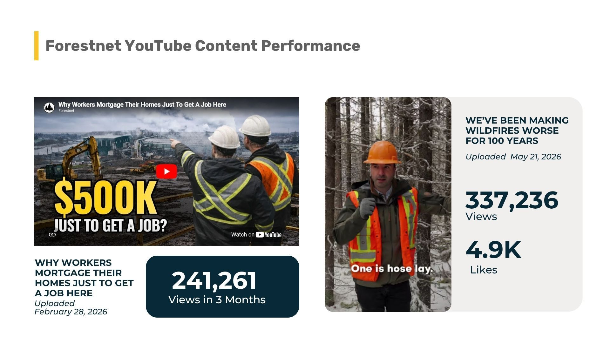

ForestNet Media had decades of industry credibility and an ambitious content roadmap, but editing, publishing, and managing their YouTube channel was eating into time they didn't have.

Green Light Studio stepped in as their media production team extension, and within five months, the channel crossed 1.9M views and hit monetization.

ForestNet Media didn't arrive late to digital media.

Built on two of North America's most respected forestry publications, Forestnet Magazine (Logging & Sawmilling Journal) and TimberWest Magazine, they'd been serving the sector for over 50 years.

Anthony Robinson and his team already had the network, the industry knowledge, and the access to Trade shows, sawmill tours, and executive interviews. They had content most publishers would kill for.

> "Our business is evolving rapidly away from traditional print media and toward digital media, video, social media, and online audience engagement. Having an external team that can handle those requirements professionally allows us to stay focused on growing the business while continuing to deliver content across multiple platforms."
>
> — Anthony Robinson, ForestNet Media

But moving from traditional publishing into YouTube, podcasts, and short-form content is a real operational shift. Their libraries of raw footage were getting backlogged. Their YouTube publishing schedule was ambitious.

And managing all of it in-house didn't give them the flexibility and risk management they needed to move forward without significant investment.

When Green Light Studio first got involved, ForestNet had a significant backlog of raw footage and no long-term solution to process, edit and publish it while keeping up with the firehose of new content.

"Video editing consistency, affordability, and speed are always difficult to achieve," said Jake Mooney, founder of Green Light Studio. "In-house would be too expensive, outsourcing to individual editors is difficult to control consistency, quality, and feedback. They needed ONE reliable and long-term solution that could ebb and flow if they needed to change the brief."

The scope of what needed managing was broad: long-form video and podcast editing, YouTube uploads, thumbnail design, Shorts production, podcast publishing, scripting, voiceovers, and more. Doing all of that through separate freelancers would have created more coordination work than it solved.

There was also a production quality issue on the content side. Before ForestNet brought on a dedicated videographer, the footage coming in was inconsistent.

> "We were not always receiving high-quality raw footage for editing, which affected the overall quality of the final content we were able to deliver."
>
> — Meriam Kerkeni, Marketing Projects Manager

Without fixing the workflow, the content would keep piling up, the publishing cadence would suffer, and what they were trying to build would stall.

### Making YouTube Work - internally first!

The structure Green Light Studio proposed was a flexible monthly retainer, not a per-project billing model, with the intent to build a consistent workflow.

"The idea was simple: let the client focus on what they do best, interviewing guests, attending trade shows, and touring factories, and provide raw footage for us. Then, we handle everything behind the scenes to keep content flowing, consistent, and live on YouTube." — Meriam Kerkeni

> "Green Light Studio has been a great partner for Forestnet Media. The team has been incredibly accommodating to our often hectic and unpredictable schedule. In the media world, some months are extremely busy, and others are much quieter, so having a team that can adapt quickly while consistently delivering high-quality content has been very important to us."
>
> — Anthony Robinson, ForestNet Media

In practice, that meant Green Light Studio handled the full production pipeline from receiving the footage, while Anthony and his team focused on generating content in the field.

A few things made the workflow tighter over time:

**Planning ahead and monthly status checks**

The GLS team mapped Anthony's travel schedule and upcoming events at the start of each month. This let them anticipate content volume and organize resources before footage arrived, rather than scrambling after.

**AI-assisted editing prep**

For longer interviews, the team used AI tools to quickly identify key talking points and structure edits more efficiently, reducing footage prep time and revisions.

**DaVinci Resolve Cloud**

By leveraging cloud-hosted video projects, ForestNet projects could be worked on efficiently across the globe without slowing down the team. This cut down the back-and-forth of transferring large footage files between editors and the ForestNet team, a small operational detail that adds up across dozens of projects.

"The key was staying tightly aligned with the client at every stage," Meriam explained.

In the first 6 months of 2026, ForestNet Media generated more than 1.9 Million views, more than the channel had accumulated across the previous nine years of publishing.

This shows what is possible when a brand like ForestNet commits to its media strategy. Green Light Studio is happy that we helped them achieve that milestone.

From January 1 to June 3, 2026:

**1.9M total views across all content types** (539% up vs. July-December 2025)

*   Shorts: 1.5M views (999% up vs. July-December 2025)
*   Long Form: 369.2k views (31% up vs. July-December 2025)

**+2.4K new subscribers across all content types** (539% up vs. July-December 2025)

*   Shorts: 1.3K (999% up vs. July-December 2025)
*   **25.6k Watch Time** (131% up vs. July-December 2025)

Most importantly, the channel is doing what Anthony hoped it could: show the companies that ForestNet wants to work with that ForestNet is the best solution as a media and marketing partner in the timber industry.

### Why This Project Mattered to Us

"With our background in the sawmill, forestry & woodworking industries, it was a great fit because we understand the industry," Jake said. "We want to get those positive messages about the wood industry to the public and help wood companies tell their message."

That shared context matters. The forestry industry doesn't always get fair coverage, and a lot of the companies working in it are doing important, skilled work that rarely gets told well on video.

"Helping ForestNet promote a vital industry is something we're very happy to be part of," Jake added.

> "We've appreciated Green Light Studio's flexibility, responsiveness, and ability to support our changing needs as Forestnet Media continues to grow and evolve."
>
> — Anthony Robinson, ForestNet Media
