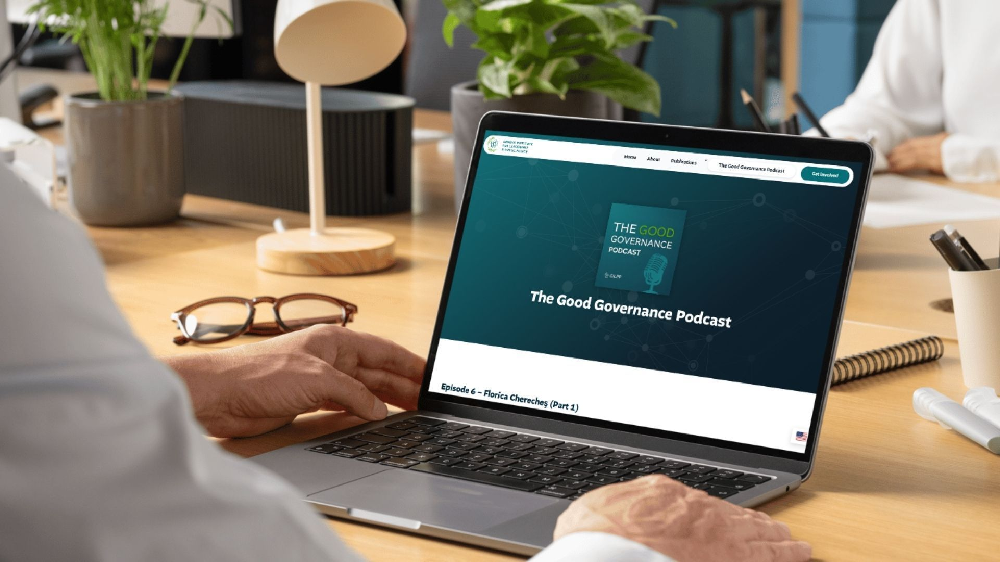
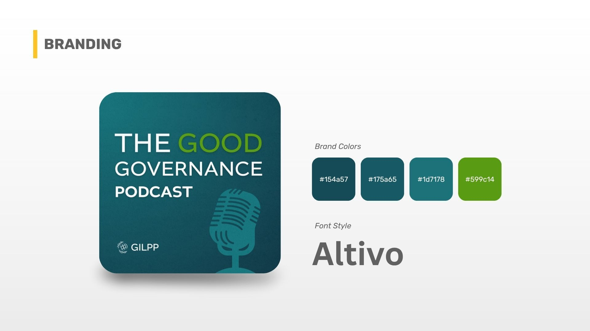
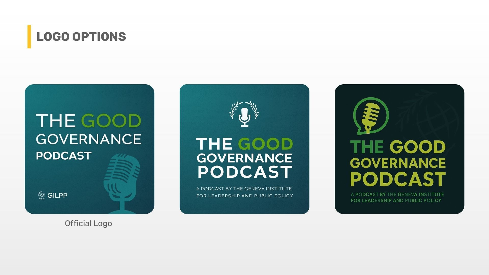
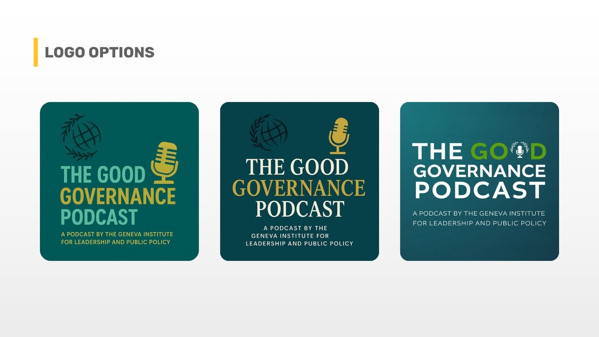
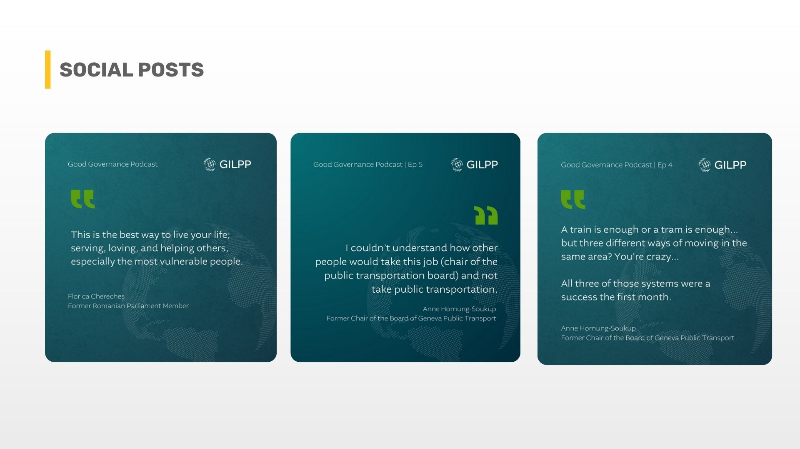
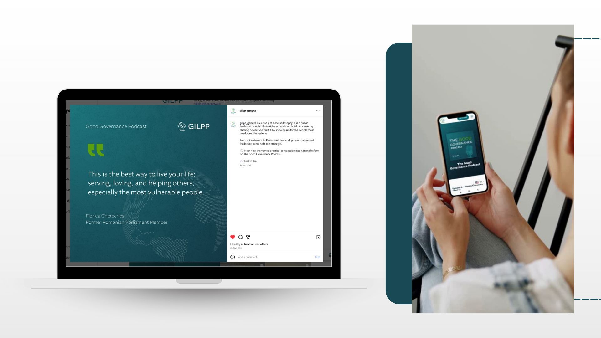

### The [Geneva Institute for Leadership and Public Policy](https://gilpp.org/)  (GILPP) has always been surrounded by powerful conversations among senior political figures, emerging policymakers, and global leaders discussing what good governance actually entails. The problem was that these insights remained confined inside conference rooms. They weren’t being shared with the world.  

### Intro  

The organization wanted to change that. And when GILPP’s project lead, Trey, brought the idea of a podcast forward, the team knew it could amplify their mission; still, they faced limitations that made them hesitant and second-guess whether the podcast was actually feasible.  

> “We knew we wanted to reach more people with our message and get our name out there, but didn't know how to set up or run a professional podcast.”
>
> — Trey Cason, Director, Geneva Institute for Leadership and Public Policy

For an NGO working across 30+ nations, the stakes were high. This podcast needed to convey a sense of credibility, structure, and reflect the organization’s global reputation.  

## The Challenge

GILPP’s mission is rooted in helping leaders build justice, equality, and good governance. They regularly sit in the same room with experienced political figures and young policymakers who desperately need guidance. But none of those conversations were being captured, repurposed, or shared.  
  

> “They have access to all these people, and they didn't have a good system for turning these insights into something that could be shared more widely.”
>
> — Jake Mooney, Founder, Green Light Studio

Since this was a pilot project, the budget and capacity were tight. We understood from the get-go that they needed a podcast that looked professionally produced, one that was within their means. A podcast that’s easy to manage, doesn’t require high-end equipment that you would typically expect from a podcast studio, and most importantly, it could earn internal support and trust.  
  

> “The client didn't know which mic to use, how to run the podcast, what questions to ask…the general structure.”
>
> — Meriam Kerkeni, Project Manager, Green Light Studio

They were starting from zero, and there was a point when they didn’t want to do this halfway. However, we were able to convince them to give it a go because they only needed a system and a plan tailored to their needs, and we provided that.  

## The Green Light Studio Solution

We started with a simple pilot episode recorded on a phone. Using tools like Adobe Enhance and our podcast editing setup, we cleaned it up and turned that rough recording into something that sounded surprisingly professional. Once the team heard it, they got excited and could instantly imagine what the podcast could become.  
  

From there, we built a workflow that kept everything easy for them. Each episode included:

  

*   Full audio cleanup  
      
    
*   Intro and outro music  
      
    
*   A tight 25-minute edit  
      
    
*   Two strong opening statements  
      
    
*   Episode titles and descriptions  
      
    
*   Two SEO-friendly articles  
      
    
*   Two social posts with Canva graphics  
      
    

> “Y'all just made it so easy. Plug and play. I can focus on the parts of the Podcast that I am interested in and y'all handle the rest.”
>
> — Trey Cason, Director, Geneva Institute for Leadership and Public Policy

Behind the scenes, we solved the structure problem first.  

> “Templatizing the podcast made every new episode really clear, what to do, where to put it, how to create a certain flow.”
>
> — Meriam Kerkeni, Project Manager, Green Light Studio

We also helped GILPP avoid unnecessary expenses and complexity.  

> “They didn’t need to go out and buy a bunch of expensive equipment…What they needed was good graphics, a clear plan, and a few recorded sessions. We’d handle the professional editing.”
>
> — Jake Mooney, Founder, Green Light Studio

For the writing and repurposed content, we used AI tools trained on their voice, brand, organization, and tone. We also trained those tools in each revision so that the content created each time was very close to a final content piece.  For the collaboration, we remained tightly aligned through Google Docs, where the client directly provided their feedback.  

## The Results

With the new system in place, GILPP officially launched [The Good Governance Podcast](https://gilpp.org/the-good-governance-podcast/), complete with the name, cover design, structure, and editing approach we helped establish.  
  

The impact was immediate:  

  

*   A professional, credible podcast that reflects their global reputation  
      
    
*   A  system that doesn’t drain their internal team  
      
    
*   Articles and social posts extending the reach of each episode  
      
    
*   Content that reinforces their authority in leadership and governance  
      
    
*   A successful pilot, they could confidently present to management  
      
    

  

> “The Pod is lending legitimacy to our organization, and we are reaching new people.”
>
> — Trey Cason, Director, Geneva Institute for Leadership and Public Policy

Inside GLS, seeing it live was just as rewarding.  

> “Always great to see the efforts you put into something live.”
>
> — Meriam Kerkeni, Project Manager, Green Light Studio

## Final Thoughts

GILPP already had meaningful, high-level conversations happening every day. They just needed a system to bring those conversations to a wider audience, professionally, consistently, and without overwhelming their team.  

> “We are very proud to be involved with such an organization that's doing this kind of work throughout the world.”
>
> — Jake Mooney, Founder, Green Light Studio

If your organization has expertise, knowledge, or ideas that deserve to be heard, Green Light Studio can build a process that makes sharing them simple.

Reach out anytime,  we’d love to help you bring your message to life.
