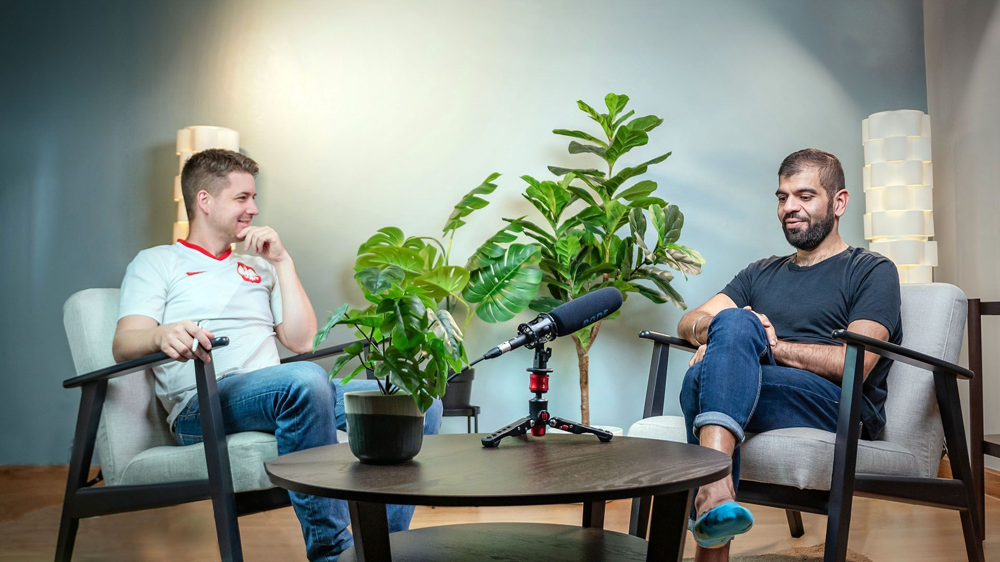
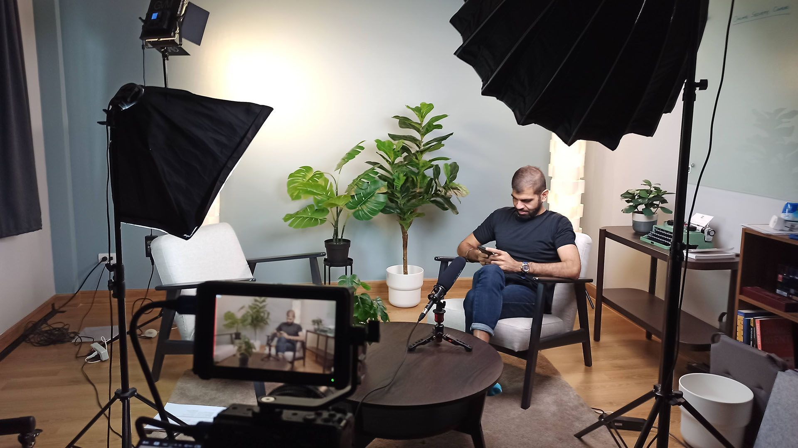
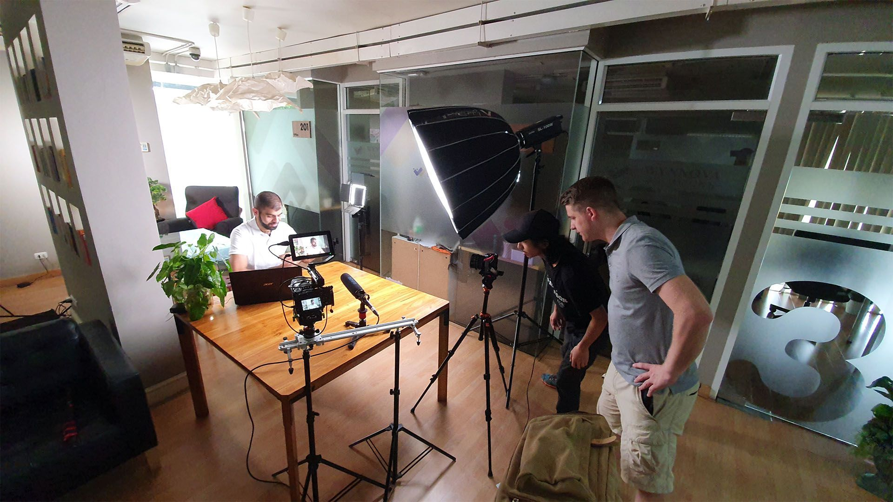
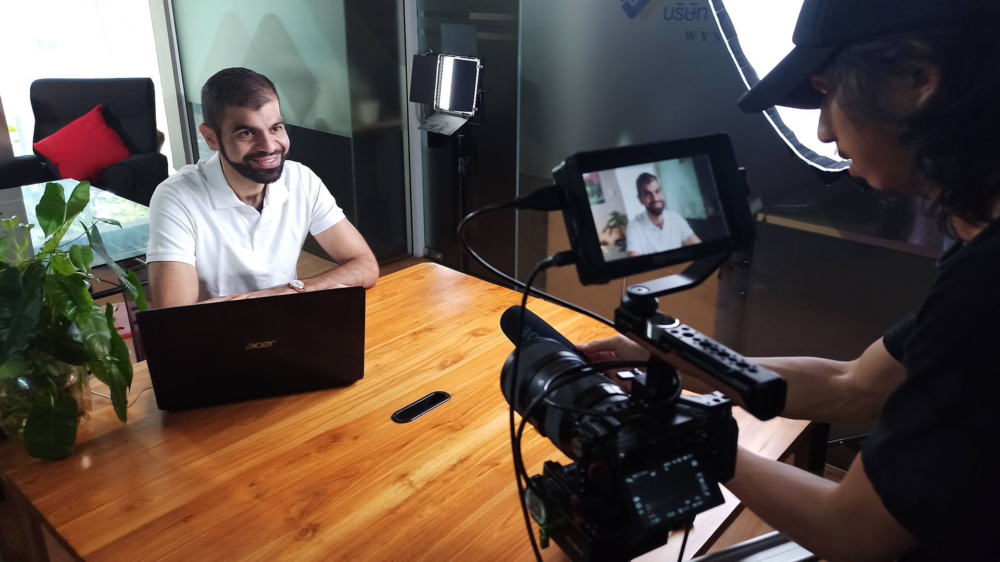
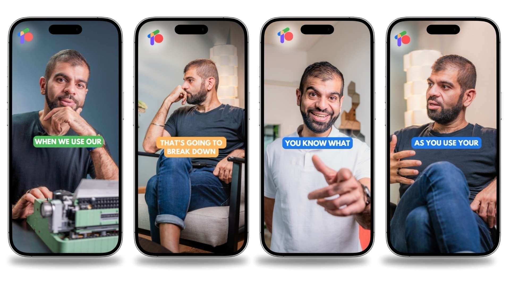
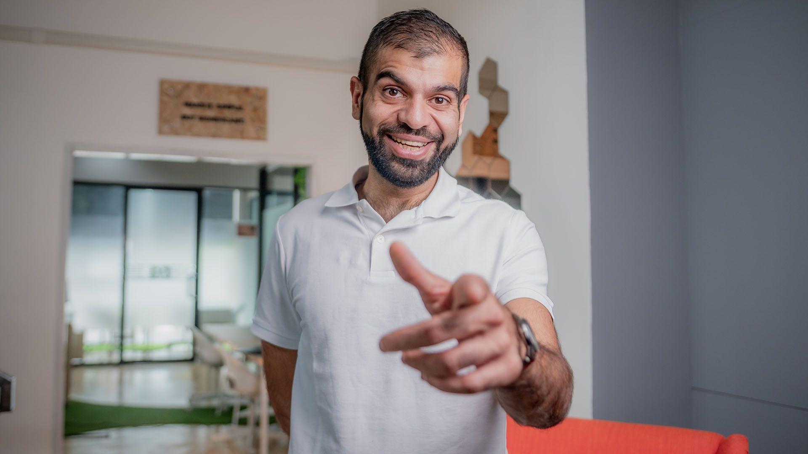
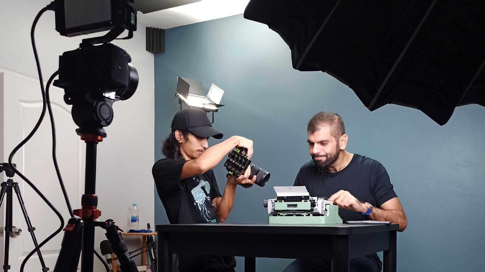
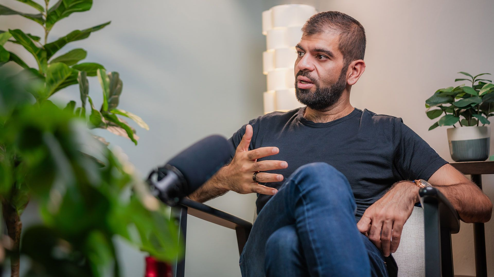
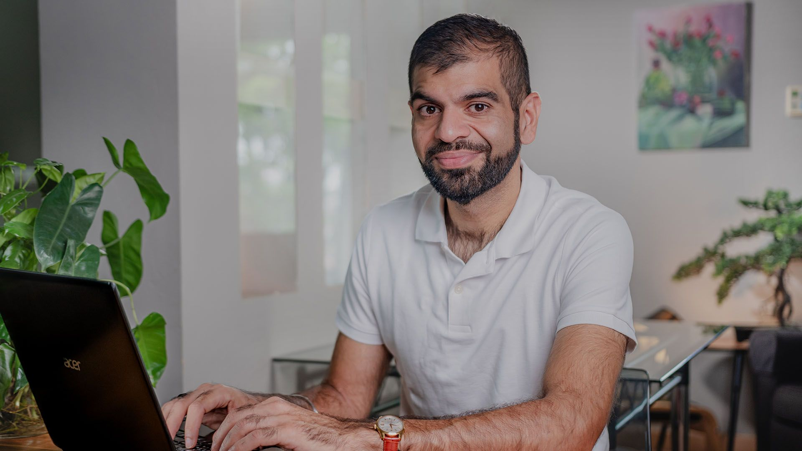

### Beyond the Startup: Building a Personal Brand That Lasts

A startup founder needed to impress… quickly and authentically.  

**Overview**

Ronnie Teja, an accomplished entrepreneur and CEO of Truly Office and Branzio Watches, approached Green Light Studio to develop a dynamic personal brand and establish a strong digital presence for his startup, Truly Office. Leveraging over 15 years of e-commerce expertise, Ronnie sought to amplify his impact through engaging, professional content that resonated with his target audience.  

### **Challenges**  

**Building a Multifaceted Personal Brand:** Establishing Ronnie as a credible figure across diverse platforms while aligning with Truly Office's mission to create accessible, secure tech solutions.  

**Content Longevity:** Creating materials that could support Ronnie’s online presence for years, requiring versatile, evergreen content.

**Cross-Platform Engagement:** Ensuring videos could be effectively repurposed for LinkedIn, YouTube, corporate sites, and other channels.

### **Solutions Implemented by Green Light Studio**  

**Tailored Video Production**

Over several months, Green Light Studio collaborated closely with Ronnie to produce a range of high-quality video content.

*   **Video Shoots:** Organized across various locations to suit professional and personal branding objectives.

*   **Content Styles:** Included video sales letters (VSLs), podcasts, and social media-friendly clips to diversify engagement opportunities.

*   **Fast-Paced, Engaging Editing:** Ensured all content was visually appealing, concise, and tailored to each platform’s audience.

**Content Repurposing Strategy**

*   Videos were adapted for LinkedIn posts, YouTube uploads, and Truly Office’s website.
*   The approach emphasized maximizing the lifespan of each piece, enabling Ronnie’s team to consistently maintain a fresh online presence.  
    

**Emphasizing Long-Term Brand Value**

*   Focused on sustainable branding by creating content that could seamlessly integrate with Ronnie’s evolving business ventures  
    

### **Outcomes**

*   **Enhanced Visibility:** A robust online presence helped reinforce Ronnie’s authority as an entrepreneur and thought leader in e-commerce.
*   **Scalable Content Library:** Ronnie gained a repository of reusable content, minimizing the need for continuous production.
*   **Audience Engagement:** Increased interactions across social media channels, supporting Truly Office’s mission to impact lives through accessible technology.  
    

