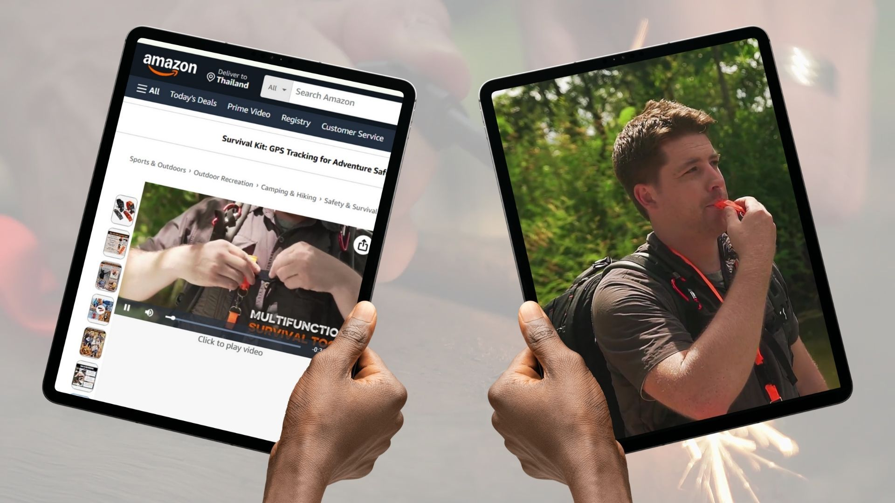
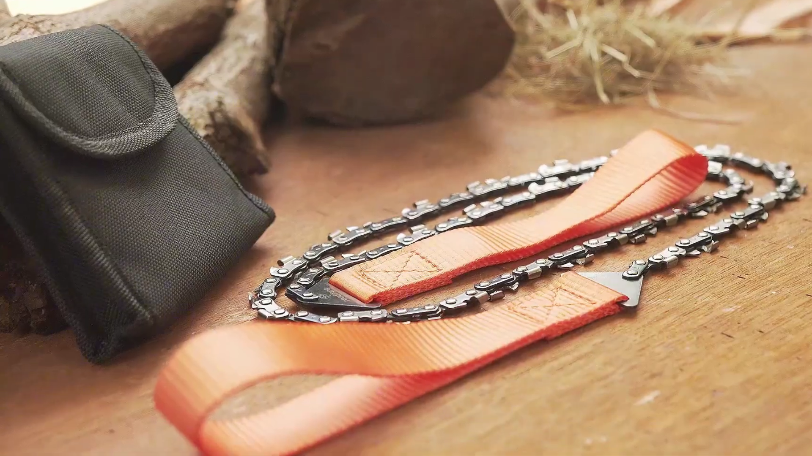
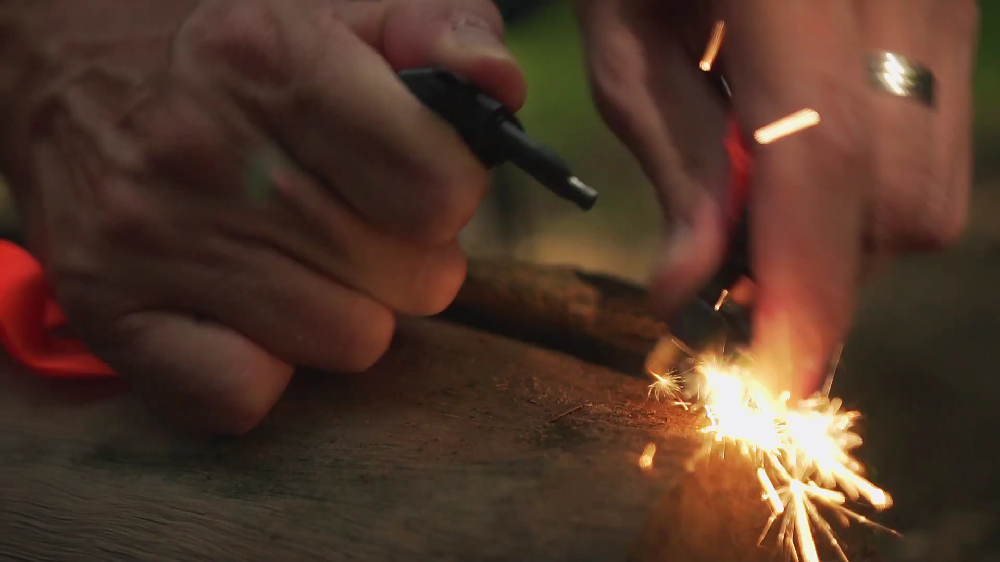

### LuxoGear knew its Amazon ads needed more than static images. We worked with them to create authentic videos that clicked with outdoor buyers.  

## Intro

LuxoGear makes tools for people who love adventure and the outdoors. But when it came to selling on Amazon, static images weren’t enough. As owner David Mertens put it, “Amazon Advertising is shifting towards video and UGC, requiring showcasing the use of the product in real-life situations.”

  

That’s where Green Light Studio came in. Together, we planned and produced two short videos for each product listing that gave LuxoGear authentic, conversion-ready content, which was missing in their Amazon ads.  

## The Challenge

For LuxoGear, the problem was clear: their products were strong, but their Amazon listing needed a story.  

  

> “The goal was to showcase the use of the product to improve listing conversion and diversify ad strategy towards video.”
>
> — David Mertens, LuxoGear

But producing real-life outdoor video is rarely simple. Life shoots take time, planning, and resources, all of which can weigh on a small brand. David admitted, “Life shootings require more time and resources,” and balancing speed with authenticity was critical.

At the same time, the competition was heating up as similar survival tools with flashy videos were flooding Amazon. If LuxoGear wanted to stand out among its competitors, it needed professional content that felt rugged and real. 

## The Green Light Studio Solution

We worked closely with David from the start, making sure his expectations matched the plan. He appreciated the prep:  

> “Clear understanding of my expectations and translating that into a well-built quote and action plan. Running through the plan in a 1-1 call so we were on the same page, before going into the field.”
>
> — David Mertens, LuxoGear

From the team’s side, Jake Mooney, who managed the project (and even modeled in the videos), remembers the constraints:

  
“We needed to shoot everything in one day to keep it cost-effective. That meant finding a location in the wild jungle near Chiang Mai where we could start fires, cut wood, and still have lakes and mountains in the background. It worked out perfectly actually.”

  

We shot two distinct pieces for each product:

*   **Product Video:** A straightforward 30-second spot focused on the tool itself.
*   **Lifestyle Video:** A 45-second outdoor sequence showing the tool in action, with more lifestyle and adventure clips incorporated in.

Grace, who edited the videos, added:  
“Post-production had its own challenges like matching lighting and building a rugged, adventurous feel with music and stock footage. But collaborating closely with David helped us hit the right balance.”  

## The Results  

LuxoGear came away with a full set of assets consisting of videos, raw footage, and product photos for their Amazon listings and ad campaigns.David summed it up:

  

> “Our Product Listing now has great video content showcasing the use of the gear and the problem it solves for the customer in real-life situations, with improved conversion.”
>
> — David Mertens, LuxoGear

He especially valued the speed:

“Careful preparation to align and manage expectations. Quick turnaround.”

  

From the team side, Jake reflected:  
“We understood what he needed, how to deliver it without breaking the budget, and then we just got it done. ”Even the rain at the end of the shoot felt like a win. “It only rained at the end,” Jake laughed. “Honestly, it added to the fun and the look. We were exhausted by the end of the day!”  

## Final Thoughts

For LuxoGear, the project was about more than just shooting a video and making ads. It was about showing customers the reliability of their gear in a way that pictures couldn’t. The collaboration worked because both sides came prepared and trusted the process.

  

> “Terrific, the collaboration with Jake immediately clicked; straightforward communication, action-oriented, and great execution.”
>
> — David Mertens, LuxoGear

If you’re looking for a way to sell and tell your product’s story, whether for Amazon or beyond,  Green Light Studio is here to make it simple, authentic, and stress-free.
