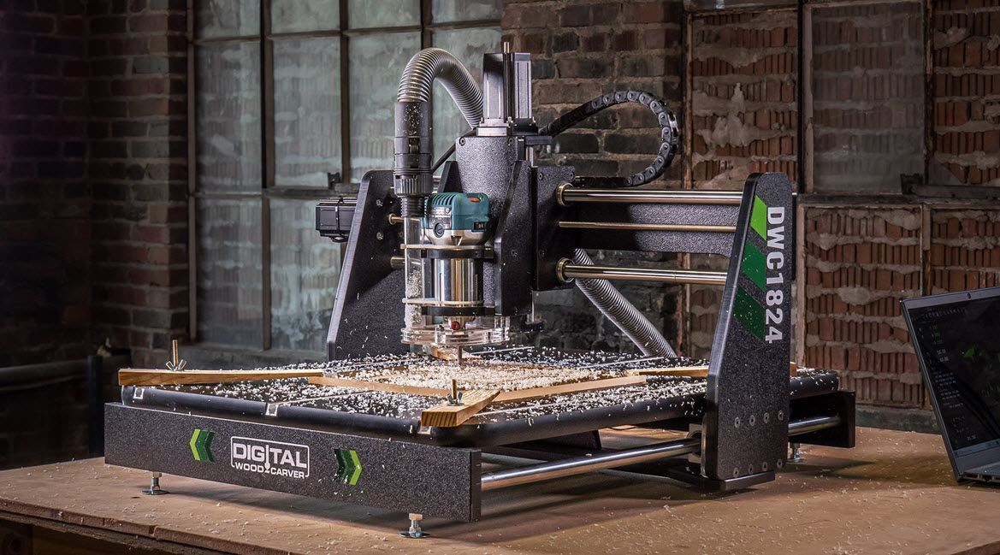
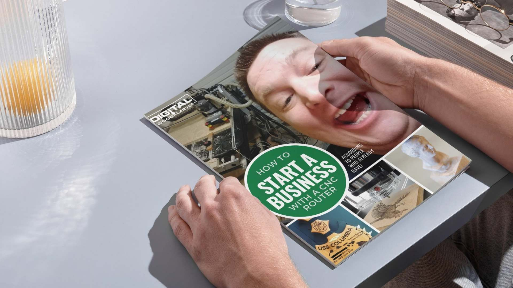
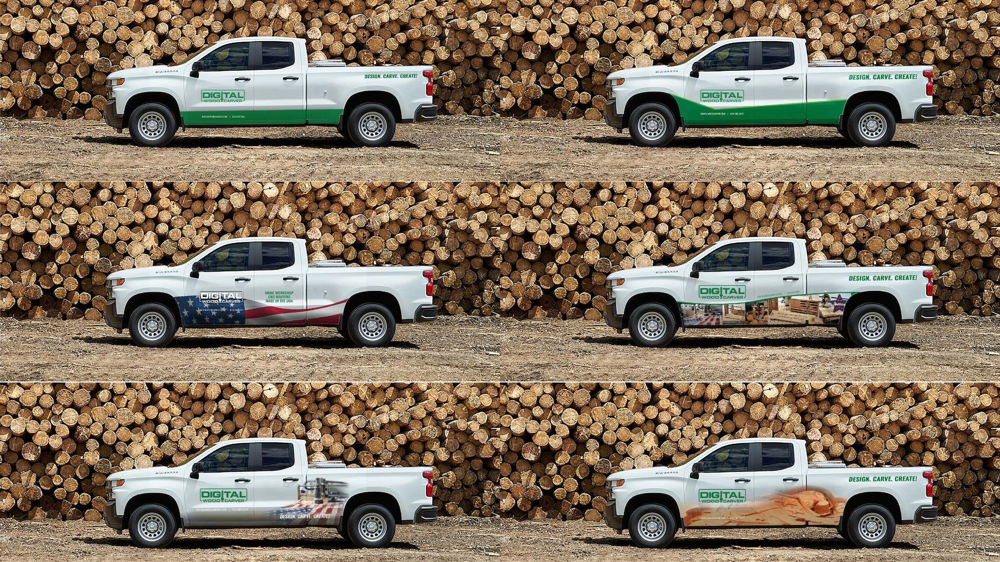
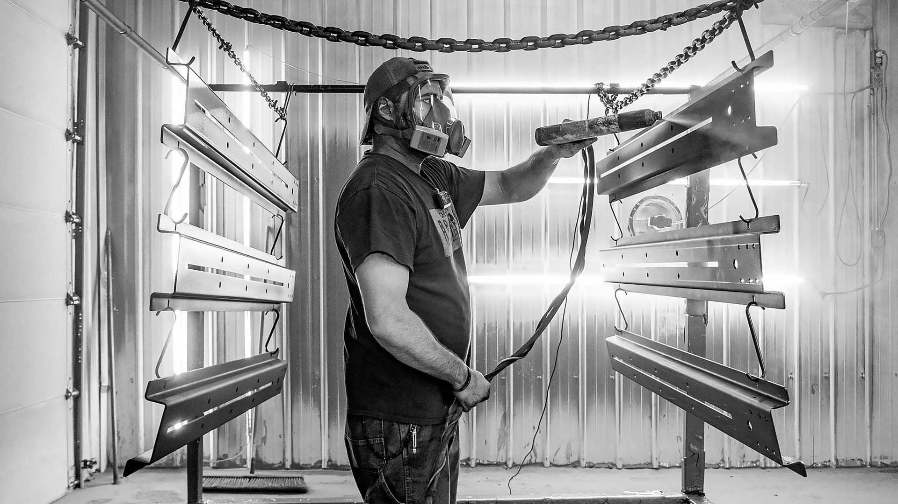
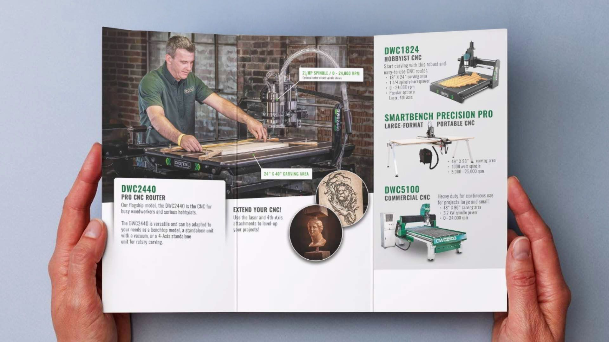

### Solving inconsistent marketing with an experienced team—without hiring in-house

### A Reliable Marketing Partner

  

When Digital Wood Carver (DWC) partnered with Green Light Studio (GLS) in 2020, they needed more than marketing services—they needed a team to handle daily marketing efforts while modernizing their online presence.

  

Over five years, that collaboration has helped DWC create a consistent, effective marketing strategy while freeing their team to focus on growth.  
  

*Behind the scenes: product photoshoots, on-site filming, and ongoing project photography.*

### The Challenge

  

Like many small businesses, DWC faced:

*   Limited Time & Resources – The owner and sales team were stretched thin, struggling to keep marketing consistent.
*   An Outdated Online Presence – Their website functioned but lacked a polished, customer-friendly experience.
*   Disjointed Marketing Efforts – Without a clear plan, their campaigns weren’t generating the impact they needed.

  

### The Solution

  

GLS developed a structured marketing strategy, providing:

*   A Website Refresh – A cleaner, more functional site with an improved user experience.
*   Consistent Campaigns – Email marketing, social media, and ads aligned to DWC’s goals.
*   Professional Visuals – High-quality product photos and videos to enhance sales materials.
*   Event & Lead Support – Helping manage tradeshows, promotions, and customer follow-ups.

### The Results

  

With GLS handling marketing, DWC now benefits from:

*   Reliable Campaigns – Regular, well-timed outreach builds trust and engagement.
*   Stronger Sales Pipeline – Targeted digital marketing drives more visitors to events and boosts sales.
*   Less Stress – With GLS acting as a fractional CMO, the team can focus on operations.  
    

> Jake took over things I didn’t have time for while giving our website and campaigns a much-needed update. Now our ads bring in revenue, and the website sells effectively.
>
> — Burl Tichenor

> The GLS team is friendly, knowledgeable, and efficient. They keep you in the loop and work quickly.
>
> — Beth Tichenor

For small businesses overwhelmed by marketing demands, Green Light Studio’s Remote Marketing Team offers an easy, sustainable solution—delivering consistency, expertise, and real results without the overhead of hiring in-house.  

Ebook created for lead generation, resulting in 800+ leads

Truck decal designs

Brand photography

Product flyer design
