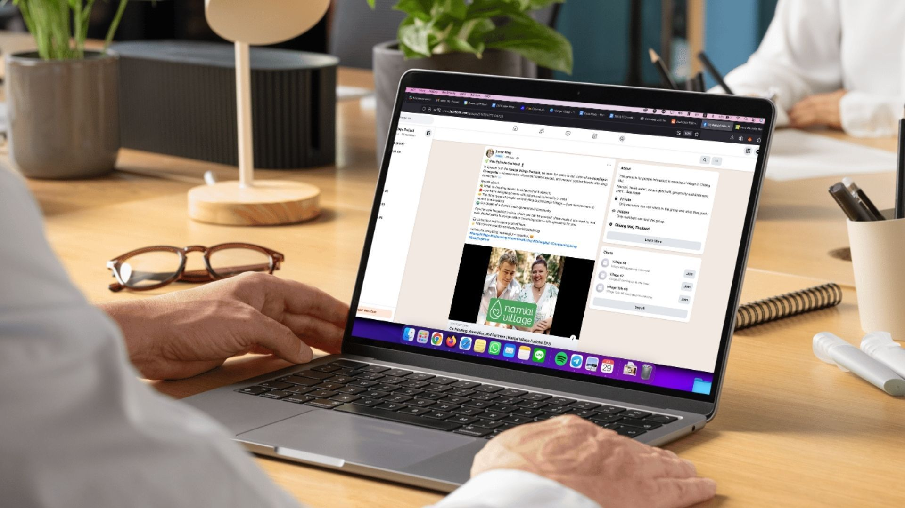
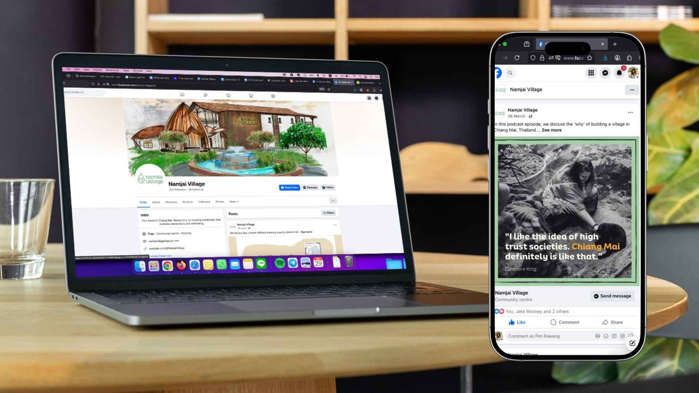

Namjai didn’t want to become full-time content creators—they just wanted to share their message. We helped them launch a podcast and turn it into a simple content system that keeps working without wearing them out.

Stefan and Eleonore at [Namjai Village](https://www.facebook.com/namjaivillagecm) had a story worth sharing—but no easy way to share it. Social media felt too fast, editing tools too clunky, and the idea of “marketing” too overwhelming. They didn’t need to be everywhere. They just needed a simple, steady way to show up.

  

## The Challenge

Namjai Village had a clear vision—a mindful, intentional living community in Chiang Mai. But that message wasn’t reaching people.

  

> “We lacked the marketing expertise and capacity to promote our project. As this was the main bottleneck at the time, we were stagnating.”
>
> — Stefan King, Namjai Village

We suggested starting a podcast. But we had more in mind than yet another podcast that no one would listen to. 

  

At first, they didn’t quite grasp the logic of making a podcast a priority at this early stage of their marketing and brand. “Who’s going to listen?” felt like a fair question. But we showed them the real power of podcasting was not as a singular marketing channel by itself, but as the cornerstone of a simple and effective content creation workflow.

  

Coming up with fresh content for social media or blogs every week is hard. It takes a lot of time, energy, and creative focus. But podcasting made it easier. By sitting down regularly to talk through what they knew and what they were learning, we got a steady stream of honest, useful insights that could be repurposed into posts, newsletters, and blogs. One recording session could power a month of content without needing them to reinvent the wheel every time.

  

## The Green Light Studio Solution

We didn’t pitch a full production studio or a daily content calendar. Instead, we [helped them launch a low-pressure podcast](https://www.greenlightstudio.co/how-we-helping-namjai-village-get-seen) that could naturally feed their content system—without eating up their time.

  

From the start, we designed everything to give Stefan and Eleonore more space instead of more tasks. Jake helped shape the first few episode ideas and build a workflow that didn’t require perfect takes or late-night edits. They focused on recording honest conversations. We handled everything else.

  

That included the backend: setting up Buzzsprout podcast hosting, designing the podcast’s cover art, and sorting the tech setup. So when it came time to launch, all they had to do was hit "record"—and we turned it into a month’s worth of content.

  

Each episode became:

*   A teaser post before launch  
    
*   A publish-day post  
    
*   A blog article version for the website  
    
*   A quote graphic to share  
      
    

Simple reminders for Stefan and Eleonore to post in their own voice  
  

> “Once we got into a rhythm, everything clicked. The last four episodes came out clean, no extra takes needed.”
>
> — Rich, Podcast Editor

We created podcast branding that felt like Namjai—warm, thoughtful, and consistent across platforms and turned each episode into ready-to-publish blog content and weekly posts, so Namjai could keep showing up without constantly stopping to figure out what to say.

And we kept things flexible. If holidays came up or feedback took a bit longer, the system could adjust. It was built to support the project—not stress it.

  

## The Results

Namjai now has a podcast that shares their story in their own words. It’s live on Spotify and Apple, backed by a calm content system that keeps their audience engaged—without requiring a full-time marketing team.

  

> “Green Light Studio covered all the content and marketing-related gaps. Important moments include your suggestion to start a podcast, your support in setting it up, and making the website.”
>
> — Stefan King, Namjai Village

The system works quietly in the background, one episode at a time.

Namjai didn’t need a flashy launch or a content empire. They just needed a calm, repeatable system—and a little help getting started. We built that with them.

  

Thinking about launching a podcast but don’t want it to take over your life? Let’s build you a system that fits.
