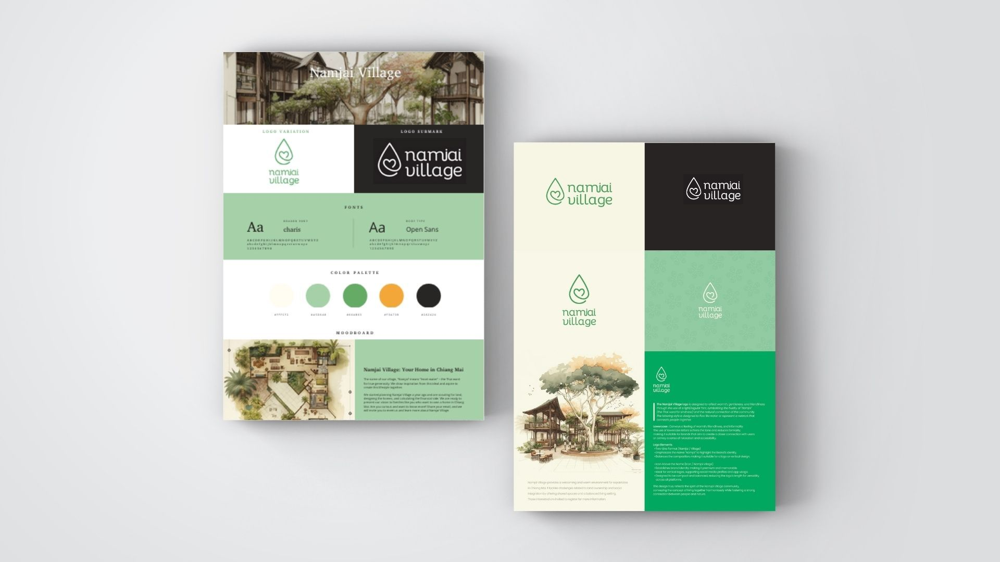
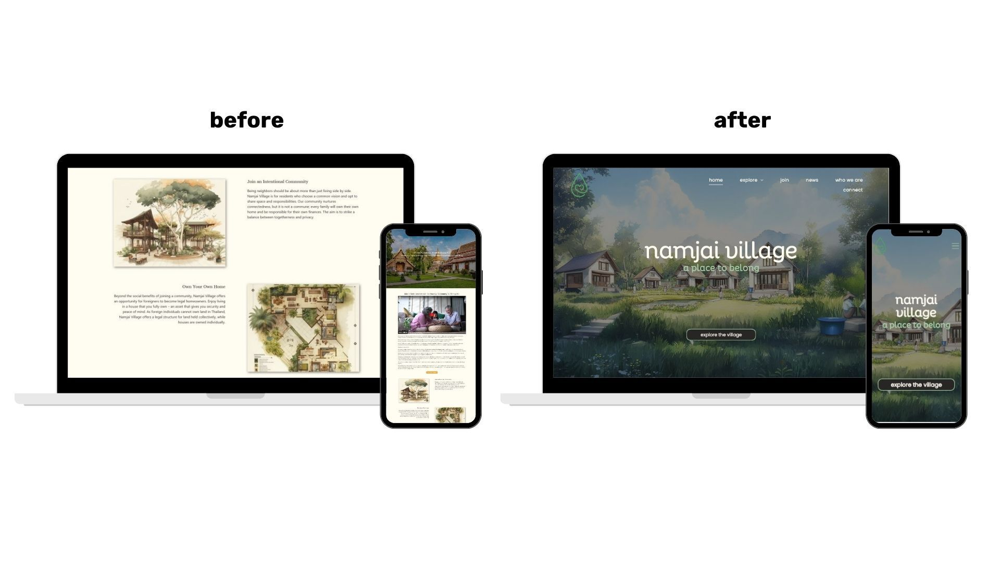
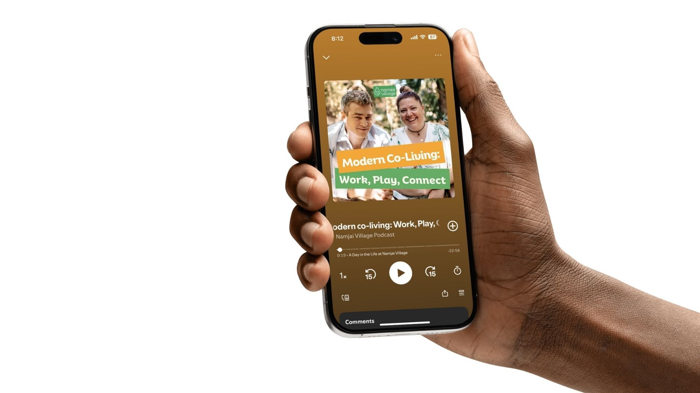
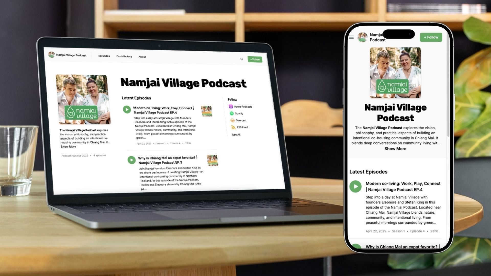
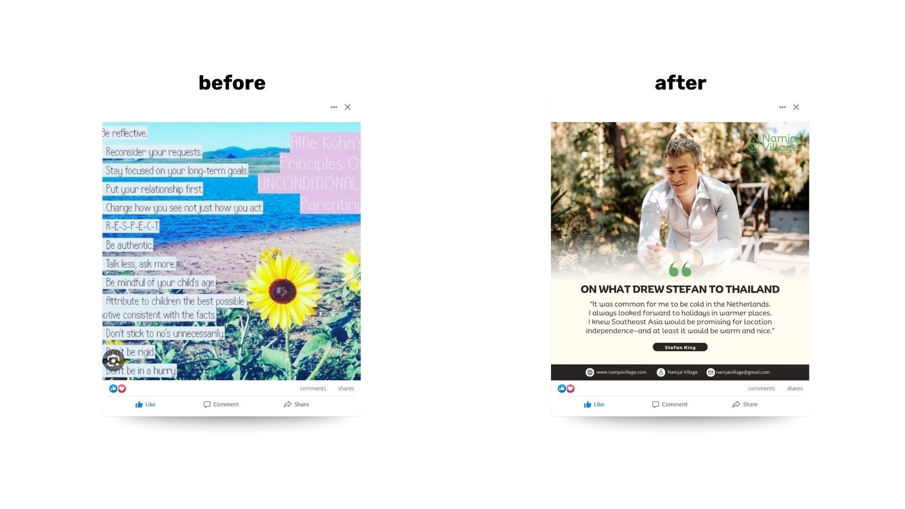

Stefan and Eleonore at Namjai Village weren’t just pitching another housing development—they were trying to build a community rooted in connection, mindfulness, and intentional living. But they didn't have a clear brand established. With no clear strategy and a website that didn’t reflect the heart of their mission, the founders couldn't push the project forward.  

## The Challenge

Namjai Village had a meaningful idea, but their messaging didn’t match the vision. Their website was clunky. They had no unified marketing plan and no system for reaching the people who might actually want to live in a place like Namjai.  

> “We lacked the marketing expertise and capacity to promote our project. We were stagnating.”
>
> — Stefan King, Namjai Village

Without a clear brand or voice, they were stuck talking in circles instead of gaining momentum.

  

## The Green Light Studio Solution

We met Namjai Village where they were—and helped them get where they needed to go. With no need for a massive rebrand or a flashy launch campaign, we focused on the practical tools they needed to finally move forward.

  

### Month 1: Branding & Strategy Foundation

Our first month's step was to clarify the brand. Jake worked with Stefan to define Namjai’s tone of voice, values, and visual identity. 

  

We also got clear on the project roadmap. We knew this wouldn’t be a one-week sprint. So we set up a four-month plan focused on one goal: steady, sustainable momentum.  

> “Helping build a brand identity that matched their values was really rewarding.”
>
> — Mild Ketsaraphon, Green Light Studio

### Month 2: Website MVP and Podcast Setup

We moved from strategy to structure. While the UI designer drafted a fresh layout for the website, Mark and Jake refined the tech setup and started building the new [Namjai Village website.](https://www.namjaivillage.com/) We launched with just the essentials: a homepage, About page, pages for the facilities and homes, FAQs, and a space for the podcast and blog. Visual placeholders (including architectural) were added with plans to swap them later for finalized artwork.

  

At the same time, we pitched the idea of a podcast. Jake helped the Namjai team with an episode plan, coached them on their first recordings, and prepare for a low-effort, high-value content channel that could grow with them. We drafted a 3-month content calendar, and our team handled editing and uploads.  

### Month 3: Content Buildout & SEO

This month was about expansion. We added real community details to the site:, stories about Namjai’s design philosophy, and answers to the most common investor and resident questions. We converted [podcast episodes](https://open.spotify.com/show/6P6DZT9Tt1v8FnMhpsqpoE?si=22615cbc7c464cbc) into blog posts, optimized each page for search, and tied it all together with consistent visuals and captions across social media.

  

We also started testing outreach—pitching podcast guest appearances for Stefan and Eleonore to get the word out on other aligned shows.  

> “With well-designed branded resources, it was much easier to build the rest of the pages without a specific brief.”
>
> — Mark Kearns, Green Light Studio

### Month 4: Full Launch + Promotion

By the last month, everything was live. The podcast was up on Spotify and Apple via Buzzsprout.com. The website was fast, functional, and felt like Namjai. Our team continued handling editing podcasts, creating blogs and social media posts, and publishing them.  

> “GLS covered all the content and marketing-related gaps. Important moments include your suggestion to start a podcast, your support in setting it up, and making the website.”
>
> — Stefan King, Namjai Village

## Results

In just a few months, Namjai has the marketing base to now move forward and market and engage with potential investors because they have the brand and expected marketing assets in place. Their site told the story clearly. Their podcast made the project feel real. And their weekly content kept people engaged without overloading the team.  
  

Namjai didn’t need a full rebrand or massive ad spend. They needed clarity, consistency, and a few tools to keep things moving. We gave them just enough support to take the next steps—and we’re still alongside them, helping the project grow one piece at a time.

  

Got a bold idea but no momentum? Let’s build something steady together.
