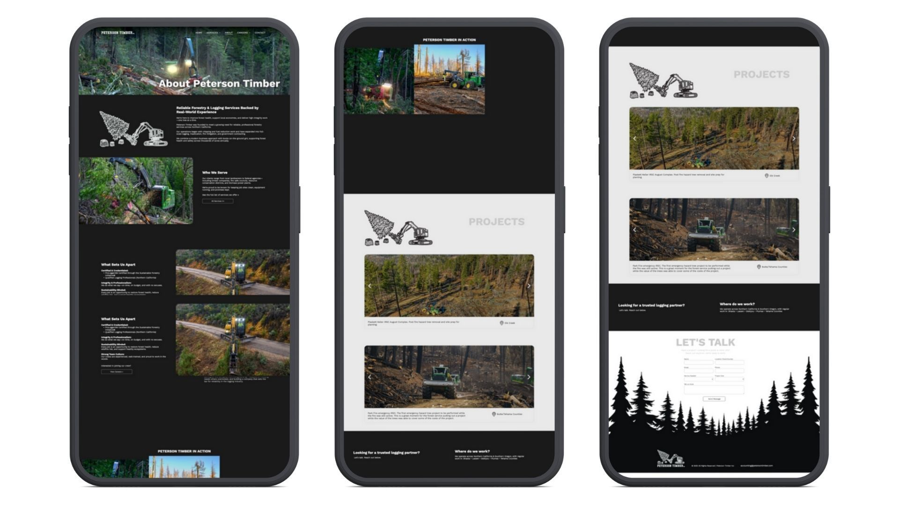
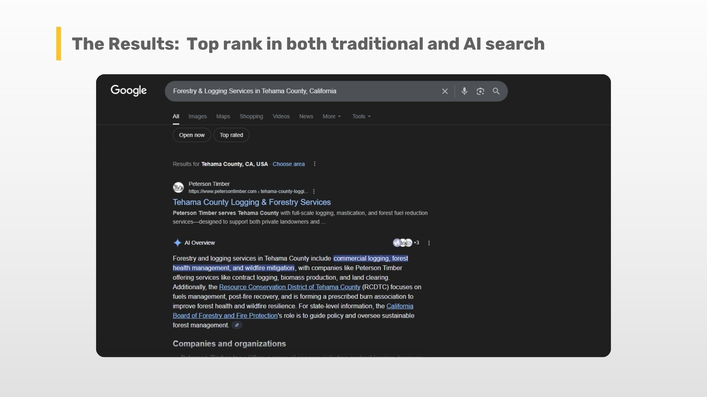
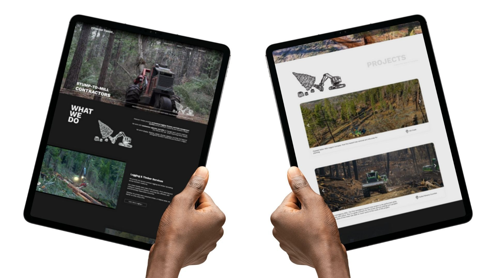

### Peterson Timber, a Northern California logging company, had no website or social presence. Green Light Studio helped them build a fast, visual, and professional Duda website that now ranks first on Google and AI search results, turning a complete offline business into a trusted online brand.

## Introducing Peterson Timber: A Northern California Logging Company 

  
[Peterson Timber](https://www.petersontimber.com/) operates logging and forest management operations across Northern California, but had no online presence at all to showcase the scope of their work or attract new talent.

> “They had no social media, no website, and they barely even have a Google Maps location.”
>
> — Jake Mooney, Project Manager, Green Light Studio

The client’s  goal was clear - a clean, professional website that shows who they are and helps them hire more people, and no extras they didn’t need  

## The Challenge: Building a Website for a Time-Constrained Timber Business

Owner Zane Peterson runs a demanding operation with multiple crews, trucks, and complex logistics. Meaning we were on a time crunch, and meetings were not an option.

Getting new business was not a goal of the website, since Peterson Timber already has a good reputation in that region for the work they do. We needed to build a new site that would help people see why Peterson Timber is a great place to work.  
  

> “They had no social media, no website, and they barely even have a Google Maps location.”
>
> — Jake Mooney, Project Manager, Green Light Studio

Without a website, the business risked missing out on skilled recruits.  

## Our Solution: A Visual-First, Duda Website Development Approach for Peterson Timber

We built the process around a single discovery meeting with Zane, where we asked questions about their company and the services they provide. Through that, we were able to create a plan, website structure, content, and game plan.  
  

> “We sent them a proposal on how we could build the site in a stripped-down way. We had one deep dive discovery meeting…and then from then on, it was basically between me and Jason to break that all down into content and pages and write it.”
>
> — Jake Mooney, Project Manager, Green Light Studio

On this project, Jake worked closely with photographer and videographer Jason Davenport. We built a visual-first website that used real photos and video from Peterson Timber’s operations. The site was developed on Duda, keeping it fast, modern, and easy for their team to manage if they wanted to.  

## SEO & Business Results: Achieving Top Search Rankings and Attracting Top Talent

When the final site was revealed, the client only requested two small revisions. Once we worked that out, we proceeded to publish the website. The immediate search performance of the new site not only meets our objectives; it far exceeded all expectations, achieving instant authority and visibility.  
  

### Search Domination: Local SEO & AEO Success

The strategic focus on county-specific service pages paid off immediately. Within weeks of launch, Peterson Timber achieved a Page 1 organic ranking for core services across all target geographical areas.  
  

For high-intent local searches (e.g., "logging services \[County Name\]"), the site vaulted from zero online presence to securing the highly coveted #1 spot in Google's traditional search results.  
  
Furthermore, the site's clear, structured content led to instant Answer Engine Optimization (AEO) success. The website is now frequently cited by AI-powered search features (like Google's AI Overviews) as an authoritative source for logging and forest management, positioning the Peterson Timber brand directly in front of searchers before they click a link.  

> “The client is at the top of the search results after having zero online presence in any way, shape, or form previous to that.”
>
> — Jake Mooney, Project Manager, Green Light Studio

The collaboration between Jason and our team made the difference. We understood the project’s purpose and ensured that we built it to serve its intended purpose, not become something more or less than it needed to be. 

## Final Thoughts: Zero to #1 in Search Results

Peterson Timber now has a professional, search-optimized website that helps attract top talent and establish credibility with partners. 

> “The client was thrilled with the result. We showcased them using the great photography and video that Jason Davenport had available over the last few months and years of capturing it for this client.”
>
> — Jake Mooney, Project Manager, Green Light Studio

Sometimes, one focused meeting and the right collaboration are all it takes to turn “no presence at all” into a lasting digital success story.

  

Want to build your company’s first real online presence? Let’s make it simple, strong, and built to last.
