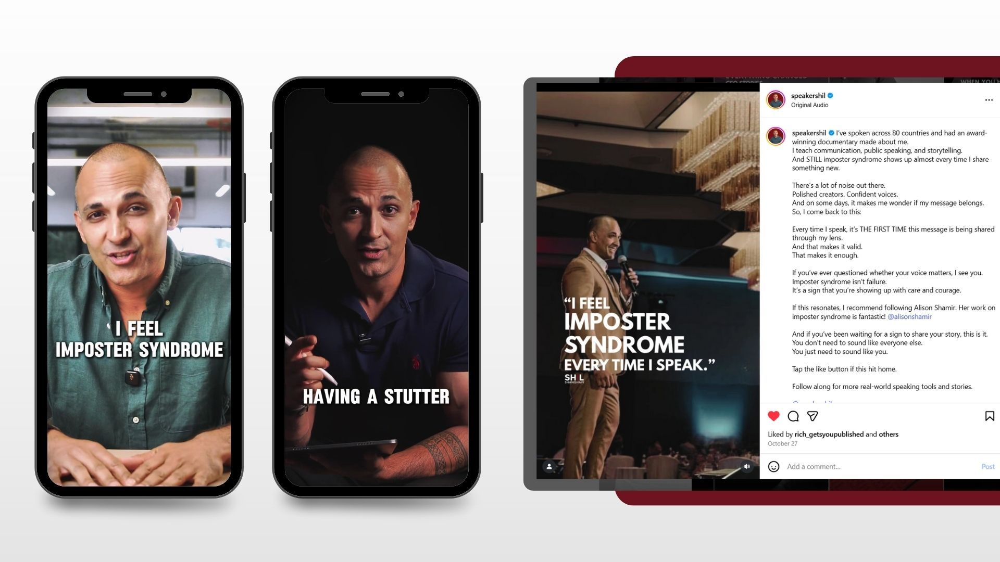
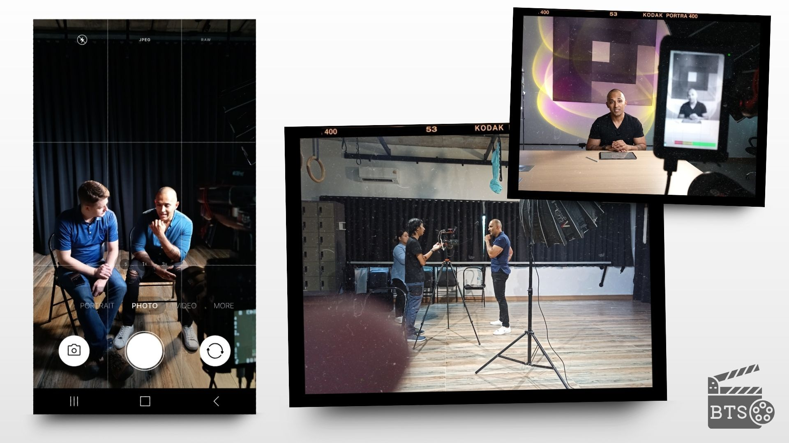
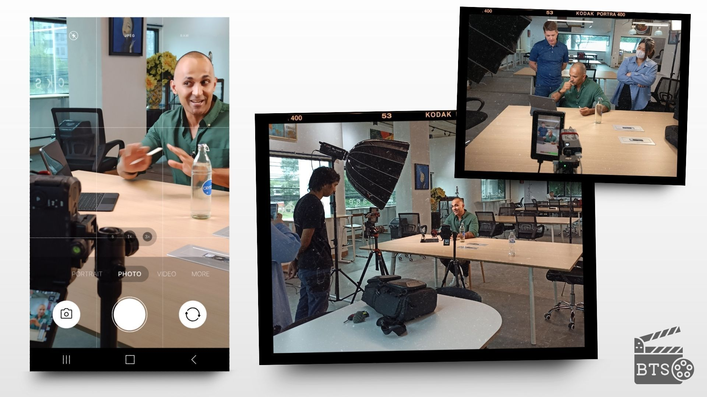
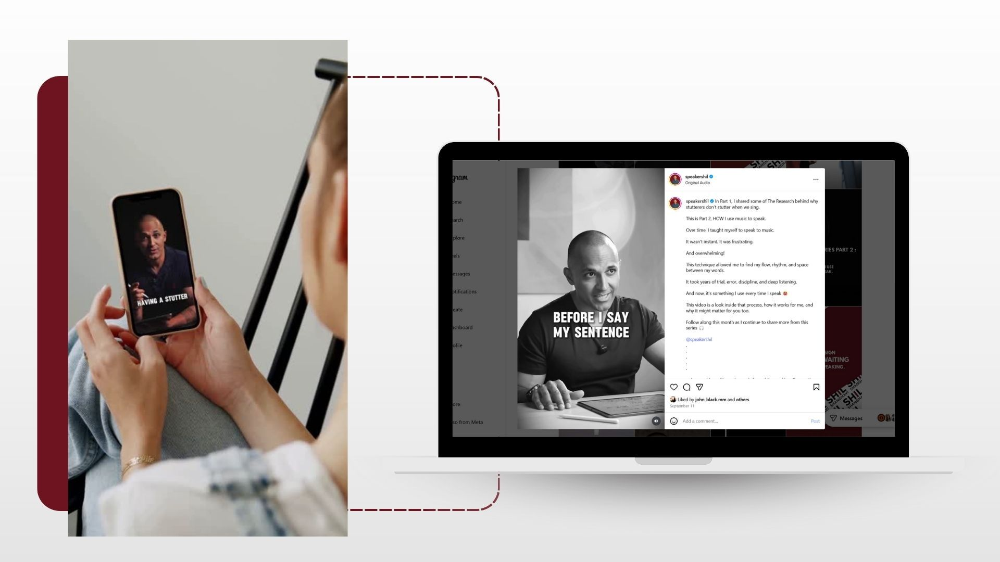

### Shil Shanghavi had the vision, message, and charisma, but needed a local team who could turn it into authentic, high-impact video content fast. We made it happen in a one-day shoot to produce on-brand Reels filmed, edited, and delivered for Instagram and LinkedIn.

## Intro

When global speaker Shil Shanghavi ([@speakershil](https://www.instagram.com/speakershil/)) landed in Chiang Mai for a short getaway, he wanted to make it productive by creating short-form videos that felt less like LinkedIn content and more like Instagram content. Shil, who’s known for his communication coaching for leaders, drew on his own experiences learning to communicate through a strong stutter, and needed a way to share his story in a raw and authentic way.  
  

He’d searched Fiverr and a few other platforms for a local production partner but couldn’t find a team that truly understood what he wanted. Then, through a simple Google search, he found Green Light Studio in Chiang Mai.  

  

## The Challenge

Shil wanted 15 short-form Instagram Reels that looked professional but not corporate, high-quality but very natural. The videos needed to reflect his signature Black, White, and Red branding, while keeping the tone fun, emotional, and engaging.  
  

The timing was tight because he was only in Chiang Mai for a few days, so the shoot had to be completed in one day, with room for creativity and flexibility.  
  

> “If we didn’t pull this off quickly, he’d leave without the content he needed for months of social storytelling.”
>
> — Jake Mooney, Project Manager, Green Light Studio

## The Green Light Studio Solution

We treated the project as a creative sprint, which required working hand-in-hand with Shil on our pre-planned structure to maximize the 6-hour shoot and deliver 15 high-impact Reels within a tight timeframe.  

### Pre-Production

Initially, we scouted three locations: our studio, a coffee shop, and the CNX Backstage coworking space. Eventually, we found three areas at CNXBackstage where we could get different-looking shots of everything from a single location.  

### Production

A 6-hour shoot with a two-camera setup, three-point lighting, and a two-person crew, with Jake and John on filming. Shil came prepared, confident, and completely clear on what he wanted to say.  

> “He’s one of the most skilled communicators we’ve ever worked with… we were actually ahead of schedule, which gave us time to make every shot look beautiful.”
>
> — Jake Mooney, Project Manager, Green Light Studio

### Post-Production

On the editing side, Grace from Green Light Studio’s editing team matched his style. She edited each video with fast transitions, bold text overlays, and mobile-first framing designed for Instagram and LinkedIn.  

> “We wanted every video to connect emotionally. Shil’s message deserved to reach his niche and speak to anyone chasing confidence and clarity.”
>
> — Grace Chuaaree, Video Editor, Green Light Studio

Every edit and revision was managed through a shared spreadsheet with fast turnaround times, which kept the process fast and stress-free.  

## The Results

Within a month, we delivered 15 dynamic, high-impact Reels that perfectly captured Shil’s tone, story, and brand. Each video emulates him, sharp, genuine, and full of heart.

> “I had a vision. Jake and his team took the vision, put creativity and fabulous ideas into it, and they delivered my vision exactly how I wanted it. They’re accommodating, supportive, kind, generous—and I’m so happy with the videos I have.”
>
> — Shil Shanghavi (@speakershil)

The content now anchors his ongoing strategy on Instagram (@speakershil) and LinkedIn, helping him grow his audience with authentic, storytelling-driven media.  

## Final Thoughts

What started as a simple  Google search and a quick content shoot, this project has become one of our most memorable collaborations that we have ever had.  
  
When the right preparation meets the right people, even a one-day shoot can deliver lasting impact.  
  

If you’re ready to tell your story through short-form video that actually feels like you,  
Green Light Studio can help.
