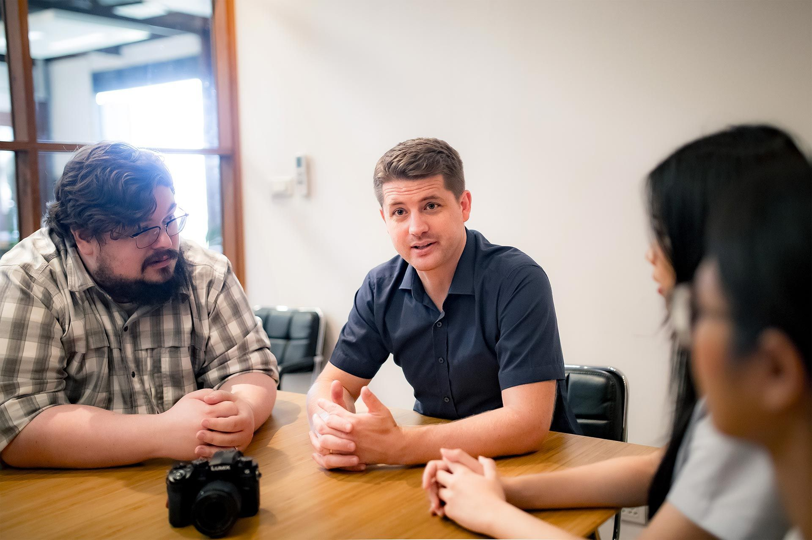
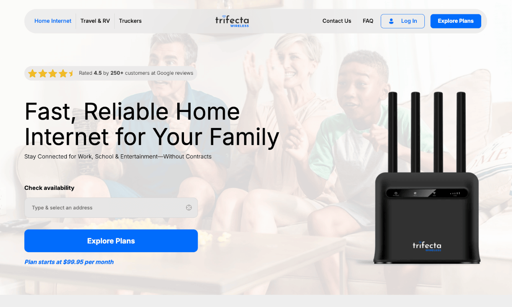

### How Green Light Studio Helped Trifecta Wireless Find the Right Marketing Direction and Turn the Business Around

#### **Client Overview**

*   **Company**: Trifecta Wireless
*   **Industry**: Internet Service Provider (ISP)
*   **Key Contact**: Steve Krupp, CEO
*   **Project Duration**: December 2024 – Ongoing

### **The Challenge: A Business at a Crossroads**

Trifecta Wireless provides high-speed internet to rural customers, digital nomads, and businesses that need reliable backup connections.

  

Despite a strong product, the company faced a two-year decline in customers and had already cycled through three marketing agencies—none of which delivered results.

  

"We had gone through three different agencies in the last year, all of which were unsuccessful," says CEO Steve Krupp. "One gave outright false conversion metrics, another would often take 5-7 days to respond to messages, and another had a prohibitively high CPA."

  

Without a clear marketing direction, conversions remained below 1%, and costly ad campaigns weren’t driving real growth. If things didn’t change, Trifecta Wireless was at risk of shutting down.

### **The Green Light Studio Approach: Strategy Before Execution**

  

Steve met Jake Mooney, founder of Green Light Studio, over a year prior. After an initial conversation, he found Jake’s advice practical and grounded, unlike the typical marketing jargon he’d encountered before.

  

"What he said resonated with what I had learned in the past, and it was spot-on advice for where we were at," Steve recalls.

At first, their calls were informal, but as Steve saw the value of Green Light Studio’s input, he decided to formally engage Jake as a consultant.

  

Jake saw that Trifecta didn’t need another agency to take over their marketing.

  

Instead, they needed:  
✅ A clear direction on what was working and what wasn’t  
✅ A structured plan for in-housing their marketing  
✅ The right people in place to execute the plan effectively

### **The Solution: A Guided Reset with Smart Hiring**

Instead of doing everything for them, Green Light Studio coached Trifecta Wireless through the reset process.

  

  
**A Marketing Audit for Clarity**"We approached the problem by giving Steve and his management team homework," Jake explains. "We gave them our [marketing audit template](/#Audit) to workshop themselves." This helped them fully understand their product, service, customers, and constraints, and gave them confidence in their next steps.

  

**In-Housing the Marketing Team**  
One of the biggest takeaways from the audit was that Trifecta needed to own their marketing in-house.

1.  Jake helped Steve identify the key roles needed
2.  He connected him with a trusted marketing freelancer
3.  They built a structure that allowed Trifecta to manage marketing sustainably

  

**Weekly Accountability & Adjustments**  
For three months, Green Light Studio held weekly calls with Steve to keep things on track. "We were able to talk through and put together some game plans," says Jake. "Steve really wanted to be a part of the process, and not just outsource it."

### **The Breakthrough: A Clear Direction Leads to Real Growth**

  

In just six weeks, Trifecta Wireless:  

🚀 Increased their customer base by 11%  
💰 Grew annual revenue by 7%  
📈 Stopped the financial decline and became profitable again

  

"We've since then begun an upward trajectory," says Steve. "The two-year decline of the company has turned around, and we're out of the danger zone of being unprofitable."

### **  
Why This Worked: The Value of the Right Guidance**

Trifecta’s previous failures weren’t just about bad agencies—they didn’t know what they needed until it was too late.  
"A consultant can be a great way to avoid that mistake and get matched up with the right implementation solution," Jake explains.

  

For Steve, the biggest value wasn’t just the strategy—it was the clarity and confidence to move forward.

  

"Working with Jake provided the clarity I needed to know how to move forward with marketing for our company," he says. "That meant we were able to keep this company alive and keep all our people employed."

### **  
Looking Ahead: Sustainable Growth for 2025 and Beyond**

"I reflect on where we were at, and there’s a very low probability that we would have figured out how to successfully do marketing as a company. Myself, my business partner, and all the people who work for us owe a massive thank you to Jake and Green Light Studio for the clarity and direction they’ve provided."
