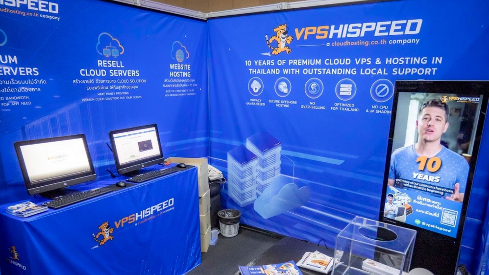
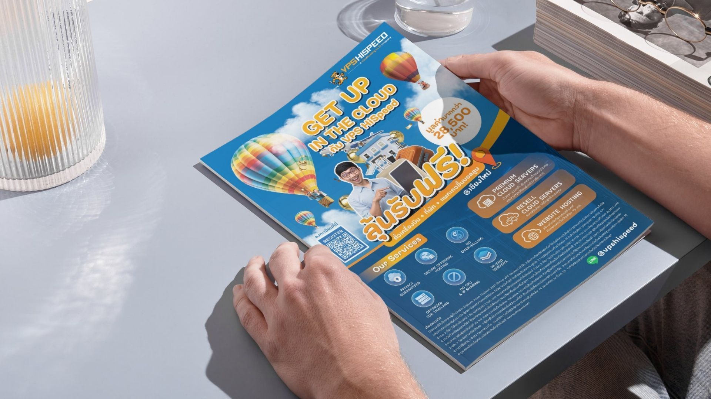
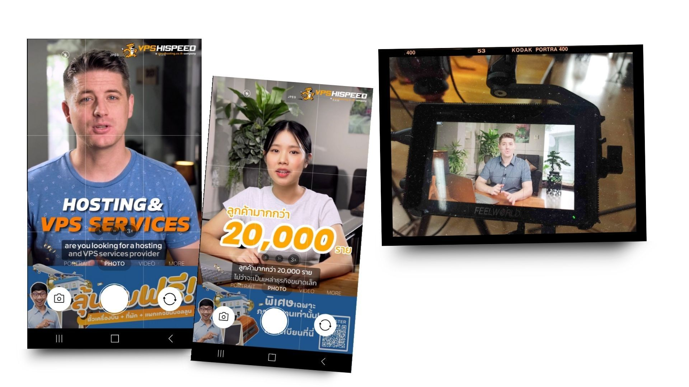
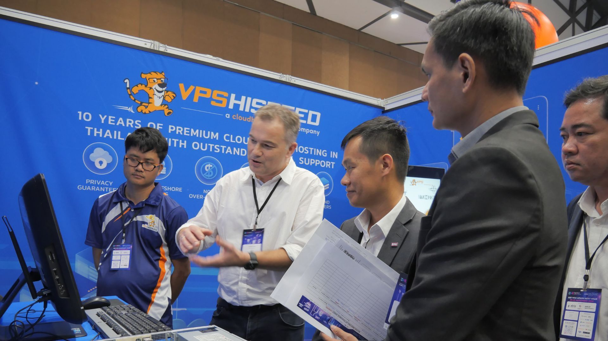

In 2023, VPS HiSpeed took a bold step to deepen brand recognition by exhibiting at DigiTech in Bangkok—one of Thailand’s major technology trade shows. As a lean, technical company without an internal marketing team, they turned to Green Light Studio to lead the initiative end-to-end.

We helped VPS HiSpeed go from concept to execution—managing booth design, logistics, equipment rental, content production, and on-the-ground event support.

  

## The Challenge

Founder Diederik de Gee is deeply involved in the technical side of his business, but after the departure of his previous marketing lead, the company had no one managing strategy or execution. While specialists still handled certain areas, there was no single person connecting the dots. That made it difficult to pursue large, coordinated marketing efforts—especially something as complex as an in-person exhibition.

  

Diederik understood the importance of visibility and customer acquisition, but needed a partner who could handle both the high-level vision and the local details. He chose Green Light Studio for our ability to deliver both.  

## What Was at Risk

Without support, the opportunity to exhibit at Digitech might have been missed—or worse, mishandled. For a business that competes on trust and reliability, showing up unprepared at a high-profile event could do more harm than good.

  

The internal team at [VPS HiSpeed](/) was focused on core operations. There was no bandwidth to take on event strategy, vendor coordination, content production, or promotion. That’s where we came in.

  

## Our Approach

We handled every aspect of the exhibition—from early planning to on-site execution.

  

Before joining Green Light Studio, Jake spent six years organizing international trade fairs for a European industrial firm—running events across Europe, Africa, and Asia. That experience shaped the way we approached this project: with structure, foresight, and adaptability, especially valuable for a lean, technically-focused company like VPS HiSpeed.

  

**Here’s how we brought it all together:**

*   Booth Booking & Coordination  
    We worked directly with the Impact Arena team in Bangkok to lock in the booth, navigate venue requirements, and manage setup logistics.  
      
    
*   Design & Print  
    Created banners, branded backdrops, and printed materials to communicate VPS HiSpeed’s value clearly—even to walk-by visitors unfamiliar with the brand.  
      
    
*   Equipment Rental  
    Sourced and arranged all technical needs, including TVs, computers, and supporting gear—ensuring the booth was fully functional and demo-ready.  
    

  

*   Promotion  
    Ran a focused social media [campaign](/) before and during the event, including a playful helium balloon giveaway in Chiang Mai to spark visibility online and offline.  
      
    
*   On-Site Support  
    Jake, Grace, and Mild represented the team in VPS HiSpeed shirts, managing everything from booth setup to photography, real-time troubleshooting, and engaging with visitors.  
      
    
*   Video Content  
    Produced and edited short-form promotional videos for use during the exhibition and as evergreen content afterward.  
      
    

All of this was coordinated across continents—Hazel, our project manager in Brazil at that time, kept the gears turning remotely, often staying up late to message rental shops and vendors in Thailand to keep everything on track.

  

## Results

Despite the many moving parts—and time zone challenges—the project came together smoothly. Booth setup was completed on time, the content looked polished, and the brand was well-represented on-site.

  

While the event turnout was smaller than hoped, the experience created lasting value:

*   VPS HiSpeed was able to confidently exhibit at a major event for the first time.
*   The team now has a full playbook for future in-person marketing.
*   Content produced for the event lives on across platforms, contributing to the 81,000+ views on their YouTube channel.  
      
    

Diederik saw firsthand that Green Light Studio could act as a reliable, full-service partner—bringing strategy and execution together.  
  

> “We don’t have a marketing team—so Green Light Studio has become the team for us. They explored different ideas, handled the details, and helped us try something we hadn’t done before.”
>
> — — Diederik de Gee, Founder of VPS HiSpeed

## Lessons Learned

Not every experiment leads to massive results on the first try. But this project demonstrated what’s possible when trust, coordination, and flexibility come together.

  

Diederik continues to explore new marketing efforts with us—because he knows the work doesn’t stop after one campaign. It’s about building long-term systems and support.
