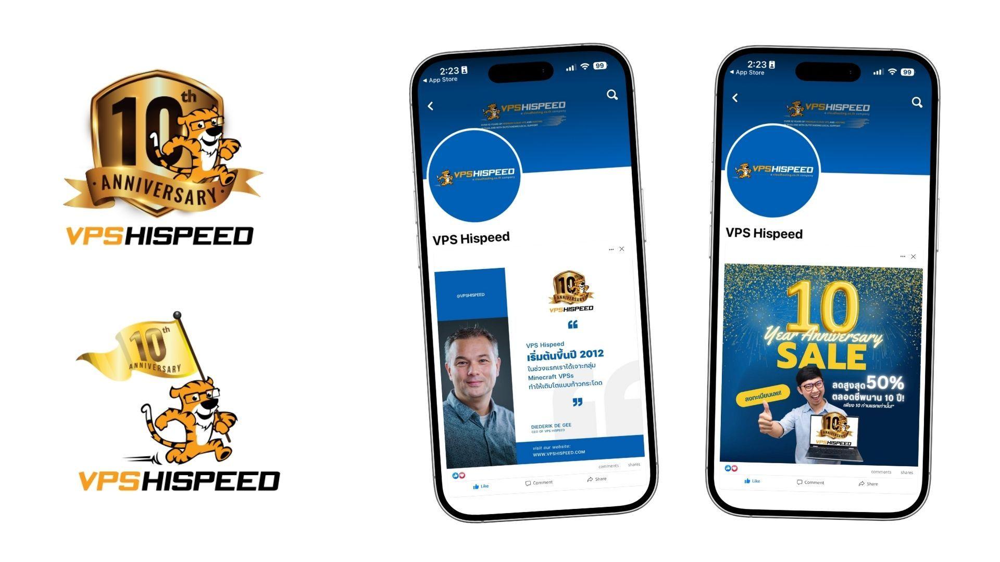
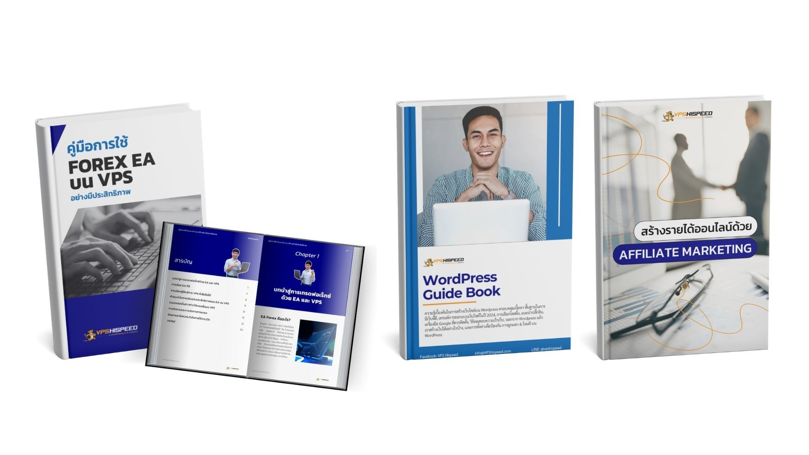

Since early 2022, Green Light Studio has served as the core marketing partner for VPS HiSpeed, a Thailand-based cloud hosting company. Working closely with founder Diederik de Gee and his team, we’ve provided full-spectrum marketing management—balancing creative strategy, ongoing execution, and cross-team coordination.

  

VPS HiSpeed had strong technical offerings but lacked cohesive branding and consistent communication. Our work focused on filling that gap: building a clear marketing roadmap, integrating story and personality into the brand, and delivering results across video, blog, social media, and design.  

## The Challenge

When VPS HiSpeed’s previous marketing lead stepped away, the company was left with siloed contractors—SEO, Google Ads, and website development—each working independently. There was no longer a unified marketing strategy or creative vision.

  

This led to:

*   Stalled growth due to lack of fresh ideas  
    
*   A templated brand image that didn’t reflect the founder’s personality or values  
    
*   Ineffective content across platforms, limiting engagement and trust  
    

> “There was no one who came up with new marketing ideas. Company growth was limited during that time.”
>
> — As Diederik (Client) shared,

## The Approach

Green Light Studio stepped in with a complete marketing management system: research, strategy, content creation, and ongoing team collaboration.

  

### 1\. Strategic Foundation

We began with a full audit of the existing marketing materials and performance. Key findings led to early initiatives, including:

*   Developing a content calendar across platforms  
    
*   Reworking brand visuals and storytelling  
    
*   Updating the website for clarity and usability  
      
    

We also marked VPS HiSpeed’s 10-year milestone in Thailand with a custom anniversary logo and brand messaging campaign.  

### 2\. Cross-Platform Content

To support both Thai and international audiences, we created content in both languages:

*   Video tutorials in [English (with Jake as host)](https://www.youtube.com/watch?v=443sdalkpfo) and [Thai](https://www.youtube.com/watch?v=3uomtzsgJOg&t=1s) (produced and presented by Mild)

  

*   [Blog](https://www.vpshispeed.com/anon-forex-review-th/) , Ebook, and [social media posts](https://www.facebook.com/servervpsthailand) aligned with trending search intent and real customer questions

  

*   Updated [FAQ section](https://www.vpshispeed.com/) and customer support content to reflect top inquiries and reduce support tickets

> “Their message wasn’t reaching the right audience in a compelling way. Addressing this was critical to improving brand awareness, customer trust, and sales conversions.”
>
> — As Mild (Our content creator) noted,

### 3\. Ongoing Coordination

Despite team members spread across the Netherlands, Chiang Mai, Bangkok, and Brazil, we maintained consistent communication:

  

*   Biweekly calls with Diederik  
      
    
*   Coordination with SEO and ad contractors  
      
    
*   Monthly planning and reporting with Hazel as project manager  
      
    

Our flexibility and clarity helped keep momentum steady, even when collaboration challenges arose.

  

> “The client was very active and supportive. He showed up to meetings and replied quickly to issues.”
>
> — Hazel (Our project manager) reflected,

## Results

  

Over two years, Green Light Studio became the central marketing team for VPS HiSpeed—balancing strategy and execution while coordinating with other specialists.

  

Key outcomes include:

  

*   81,000+ views on videos produced for their YouTube channel  
      
    
*   Improved customer engagement, with better clarity in the FAQ section and social content that sparked responses  
      
    
*   Stronger brand identity, integrating personal and professional messaging  
      
    
*   More qualified leads through structured content tied to real user needs  
      
    

> “Green Light Studio helped by continuously exploring new marketing ideas, and executing these ideas. The solutions combined have good results.”
>
> — Diederik (Client) put it

This partnership is an example of how consistent, thoughtful marketing—grounded in listening, not just output—can help a business move from stagnation to sustainable momentum.
