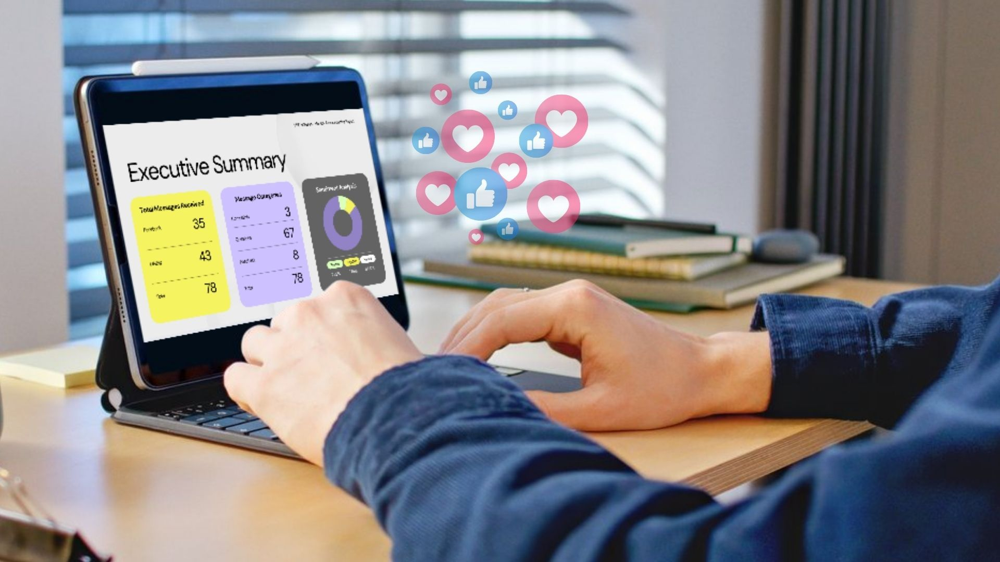
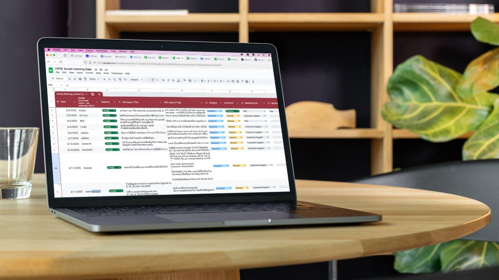
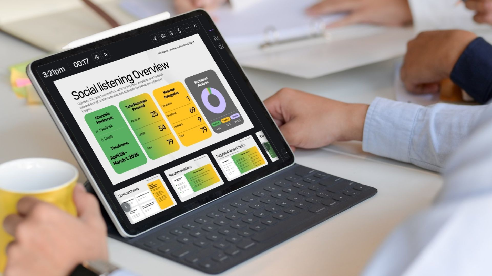

When VPS HiSpeed approached Green Light Studio, they needed more than content—they needed insight into what their customers were really concerned about. 

With a multilingual customer base and no unified system for monitoring user feedback, important customer concerns were going unnoticed. Our team proposed and implemented a social listening process that now plays a central role in shaping VPS HiSpeed’s content strategy, product improvements, and customer service workflows.

  

## The Challenge

As a founder-led company, VPS HiSpeed had capable specialists in place, but lacked an overarching marketing coordinator after their previous marketing manager stepped away. This left gaps—particularly in understanding what customers were saying in Thai on platforms like Facebook Messenger and LINE.

  

Diederik, the founder, doesn’t read Thai. He depended on updates from his support team but had no structured way to track sentiment, identify trends, or address recurring issues. This disconnect limited the company’s ability to act quickly or create content that resonated with real customer needs.

  

## What Was at Risk

Without structured listening, several risks emerged:

1.  Missed signals about customer dissatisfaction or confusion.  
      
    
2.  Lost opportunities to address repeat questions through scalable content like FAQs and videos.  
      
    
3.  Delayed responses to customer issues that could have been resolved earlier with better oversight.  
      
    

Over time, this lack of visibility threatened to slow growth and undermine the company’s reputation for reliability. But they didn’t really know it until we started.

  

## Our Approach

We began by manually collecting and reviewing all chat activity across VPS HiSpeed’s primary communication channels—Facebook and LINE@. 

  

This included:

*   Questions  
    
*   Complaints  
    
*   Compliments  
    
*   Technical support requests  
    
*   Sales inquiries  
      
    

From there, we categorized and analyzed the data to identify patterns. This process included support from AI tools but relied heavily on human judgment—especially given the bilingual context and the nuanced nature of customer feedback.  
  

### Key Contributions

*   **Monthly Analysis Reports:** Regular summaries helped highlight service trends, recurring technical questions, and potential pain points.  
      
    
*   **Actionable Content Ideas:** Insights directly informed blog topics, explainer videos, and ad campaigns. This removed guesswork from content planning.  
      
    
*   **Support System Visibility:** Diederik could finally see how his team was interacting with customers, helping him identify where training or clearer scripts might help.  
      
    
*   **Data-Driven Strategy:** Instead of creating content based on assumptions, we focused efforts on real, repeated concerns—like server speed, set-up guidance, or data security.  
      
    

> “This wasn’t about finding a flashy new strategy. It was about consistently showing the client where they could do better from what customers were actually talking about, and giving them the tools to act on it.”
>
> — Hazel Pim Rawang, our project manager, explained

## What Changed

*   **Smarter Content**:  
    We now use customer questions to guide VPS HiSpeed’s YouTube videos. These videos have boosted engagement and helped build real trust with their audience.

  

*   **Stronger Team Performanc**e:  
    Diederik started using our reports to give feedback to his support team. That’s led to better, more consistent customer responses.

  

*   **More Focused Marketing:**  
    Instead of guessing, the team now builds campaigns around what customers actually care about.

  

> “With this project, we finally understood what our audience really wants. That helped us improve our product, our marketing, and our customer service.”
>
> — — Hazel Rawang, Project Manager, Green Light Studio

This wasn’t just about collecting data. It was about finding direction. Social listening is now a key part of VPS HiSpeed’s strategy—bringing together content, support, and marketing into one clear voice. The system’s still growing, and it’s built to last. We’re proud to be the ones helping shape it.
