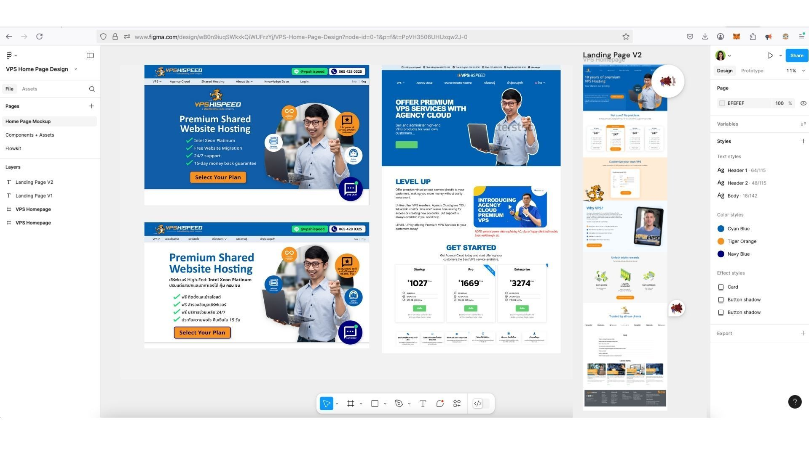
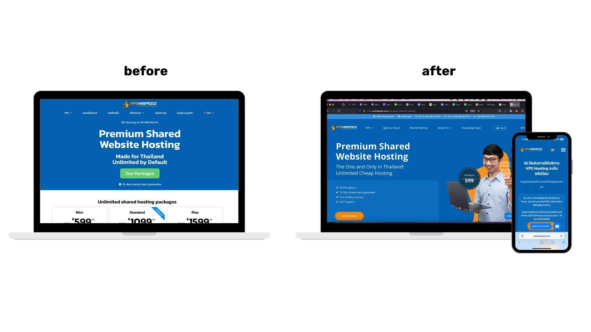

When VPS HiSpeed approached Green Light Studio about improving their digital presence, the need was clear: their existing website was outdated, text-heavy, and didn’t reflect the company’s strengths or technical capabilities. 

  

As a reliable VPS provider with more than a decade of experience in Thailand, their web presence needed to catch up to their reputation.

  

We partnered with them to deliver a full website overhaul—balancing technical clarity with human connection and positioning them as a professional, customer-first brand in a competitive hosting market.

  

## The Challenge

VPS HiSpeed’s previous website had not been updated in years. The content was dense, the design felt templated, and the overall user experience didn’t reflect the reliability and quality the company offered.

  

Diederik, the founder, knew a change was needed—but with no internal marketing lead and a small team focused on day-to-day operations, executing a major website revamp felt overwhelming. 

The complexity of managing both a live site and a development version added another layer of difficulty.

  

> “The structure of the site was more complicated than we expected. We had to be very careful about updates. Cloning, staging, finalizing—all while managing design handoffs and developer coordination.”
>
> — Hazel Pim Rawang, our project manager, explained

This was a major initiative for [VPS HiSpeed,](https://www.vpshispeed.com/) and the stakes were high. A poorly executed redesign could hurt credibility. A successful one could boost engagement, conversion, and customer trust.

  

## Our Approach

We started with a full audit—highlighting the gaps in structure, visuals, and messaging. Then we delivered a detailed proposal for improvement, including:

  

*   **Content Simplification:** Trimming technical jargon, clarifying benefits, and making the copy easier to navigate.  
      
    
*   [**Brand Personality**](/)**:** Introducing more human elements, real team visuals, and storytelling to build trust.  
      
    
*   **Redesign in WordPress:** Creating a new layout and content blocks optimized for both desktop and mobile, all within a system the VPS HiSpeed team could manage long-term.  
      
    
*   **Milestone Coordination:** Working closely with the external developer team to ensure smooth cloning and live transitions.  
      
    

It wasn’t a straight path. Managing design expectations, technical handoffs, and coordinating across multiple time zones stretched the project. But we adapted—and kept momentum by breaking down the work into manageable stages, giving Diederik the clarity he needed at each step.

  
  

## Key Features Delivered

*   A fully modernized website reflecting the company’s 10+ years of expertise  
      
    
*   Clear product information, including improved comparison tools and FAQs  
      
    
*   Bilingual content with intuitive navigation for both Thai and English users  
      
    
*   Embedded video content to address common questions and highlight unique features  
      
    
*   Better visual identity—including refreshed branding tied to their 10-year milestone  
    

  

## Outcomes

*   **Visual Impact**: The new site is clean, professional, and user-friendly. It now matches the quality of service VPS HiSpeed provides.  
      
    
*   **Improved Engagement:** The clearer layout and stronger brand voice make the site more inviting and “clickable,” as Hazel described.  
      
    
*   **Team Efficiency:** Diederik now has a scalable, maintainable site that his team can manage more independently going forward.  
    

  

> “The website looks so good—it’s way better than before. It’s professional, very clickable, and just feels right for the kind of tech company VPS HiSpeed is.”
>
> — — Hazel Rawang, Project Manager, Green Light Studio

And from the client:

  

> “Green Light Studio helped by continuously exploring new marketing ideas and executing them. The combination of all their solutions really made a difference.”
>
> — — Diederik de Gee, Founder, VPS HiSpeed

This wasn’t just a facelift—it was a strategic reset. By approaching the project with care, structure, and constant communication, we helped VPS HiSpeed elevate their online presence and strengthen their foundation for growth.

  

And it’s not just about the [website](https://www.greenlightstudio.co/services#Websites). It’s about the system behind it—one that supports ongoing campaigns, integrates video, and gives customers a clear reason to trust the brand.
