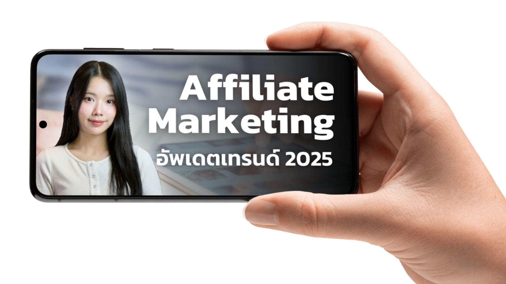
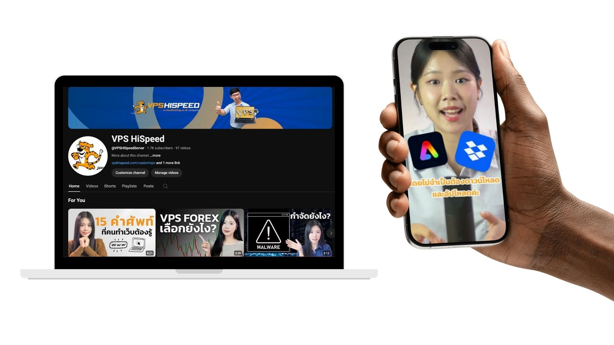

In an industry where clarity, trust, and technical guidance matter, VPS HiSpeed recognized that high-quality video content could set them apart. But creating a video strategy that felt authentic, educational, and sustainable required more than just production—it required structure.

  

Green Light Studio worked closely with VPS HiSpeed to research, script, produce, and publish YouTube videos that answered real customer questions. 

  

The result: new videos with over [81,000 views](https://www.youtube.com/@VPSHiSpeedServer), better resources for their customers and prospects, and a repeatable system for creating video content that supports sales, support, and SEO efforts alike.

  

## The Challenge

The VPS HiSpeed team had a backlog of support questions and product features they wanted to explain—but lacked the time, tools, and capacity to translate those into effective videos.

  

Initially, we launched a 3-month pilot by converting the company’s most popular blog posts into short videos. It was a practical way to test out the process and content performance while relying on articles that had already proven their popularity viaSEO traffic. 

  

That worked great to iron out the process of creating scripts, filming and editing, and then we were ready for the next steps of really producing content that focused on customer’s interests and needs.

  

  

## What Was at Risk

Without a regular video strategy, the company risked:

1.  Producing content that didn’t speak to real customer concerns  
      
    
2.  Missing opportunities to build trust with first-time users  
      
    
3.  Falling behind competitors already using YouTube as a support and marketing tool  
      
    

For a business that depends on technical confidence and customer retention, these gaps could quietly erode growth.

  

## Our Approach

We shifted our method to rely on social listening as the foundation for [video planning](https://www.greenlightstudio.co/services/youtube-channel). Instead of guessing what to say, we listened first—collecting customer questions from Facebook, LINE, and support chats.

  

This allowed us to build a sustainable video content workflow:

Topic Planning – Based on recurring customer pain points and high-interest questions.  
  

1.  **Scriptwriting** – Mild led research and scriptwriting.  
      
    
2.  **Filming &** [**Editing**](https://www.greenlightstudio.co/services/video-editing) – Using our own [studio located in Chiang Mai](https://www.greenlightstudio.co/services#studiorental) and our own staff to represent VPS HiSpeed on video, we produced both long-form explainer videos and short-form cuts for TikTok and Facebook.  
      
    
3.  **Publishing** – Each video included optimized thumbnails, captions, and cross-platform promotion.  
      
    
4.  **Content Reuse** – Blogs and social posts were created from the videos, maximizing reach.

> “This project became more than video production—it’s now a one-stop content system that ties social listening, SEO, and support into one workflow.”
>
> — — Hazel Rawang, Project Manager, Green Light Studio

## Outcomes

*   **81,000+ YouTube Views:** And growing—most videos are educational and have long shelf lives.
*   **Improved Customer Support:** Videos reduce repetitive questions by addressing common concerns.
*   **SEO Support:** Video and blog content now work in tandem to capture organic search interest.
*   **Internal Workflow:** A documented system that VPS HiSpeed can continue to build on—even as team roles evolve.

And from the client:

  

> “Green Light Studio helped by continuously exploring new marketing ideas and executing them. The combination of their ideas made a real impact.”
>
> — — Diederik de Gee, Founder, VPS HiSpeed

YouTube isn't about going viral—it’s about being visible, helpful, and consistent. For VPS HiSpeed, video is now part of a broader system that supports customer success, improves clarity, and builds long-term trust.

By rooting content in real customer questions and staying flexible enough to adapt, we helped create a content engine that delivers—month after month.
