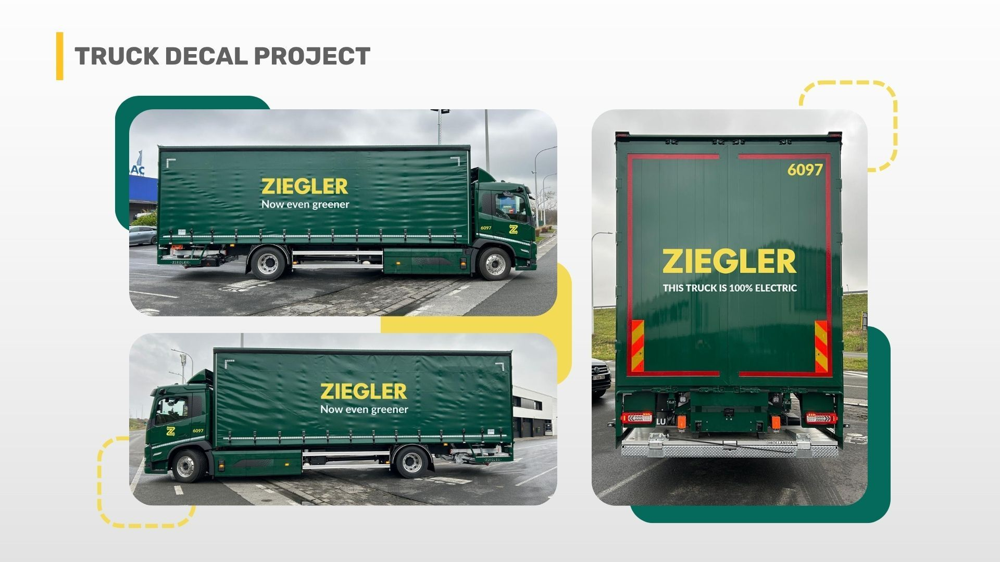
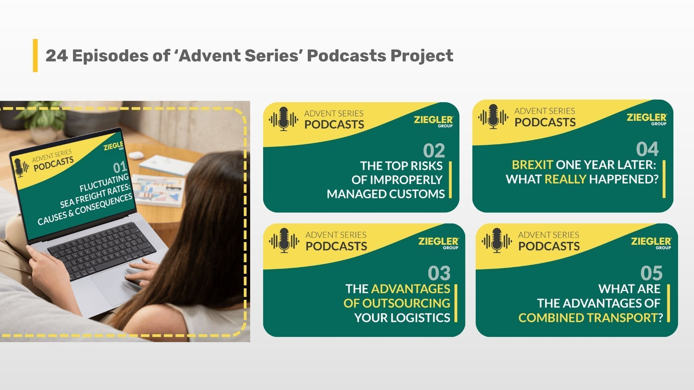
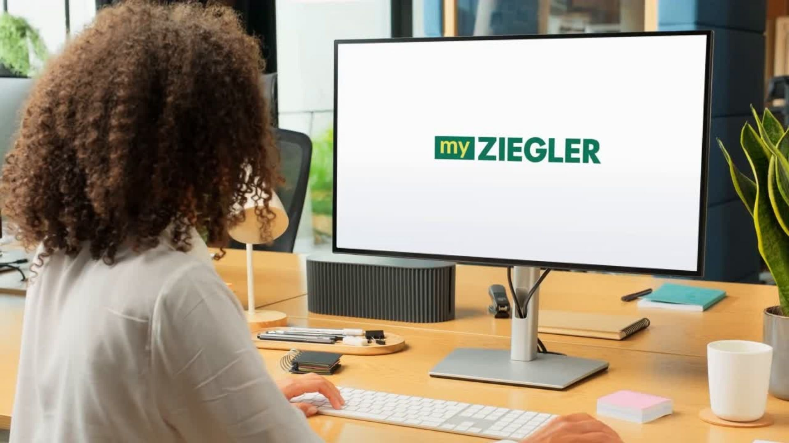
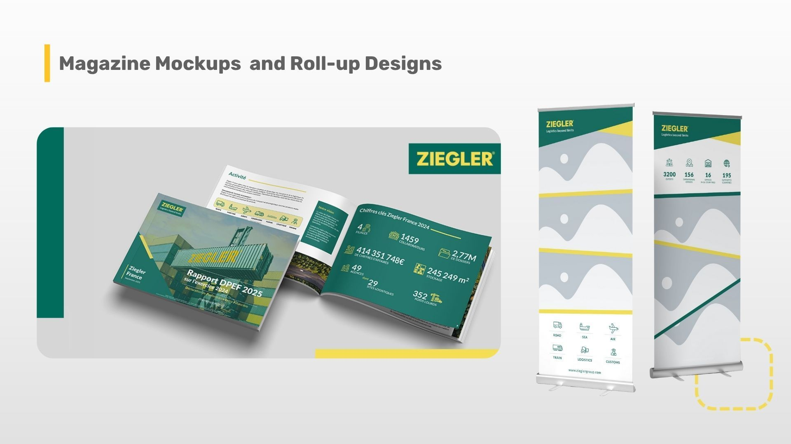

### When Ziegler Group needed long-term marketing consistency across continents, we became their on-demand team. Four years of steady support, countless projects, and one trusted partnership that still delivers, from global branding to the latest MyZiegler IT Product Video.

## Intro

When we first started working with [Ziegler Group](http://www.zieglergroup.com), their marketing was spread thin across multiple regions and teams. A new Corporate Marketing Manager had just stepped in, tasked with a massive goal: to unify and globalize a 100-year-old logistics brand operating across more than 15 countries.  
  

She needed support fast. That’s where we came in. What started as a few content projects grew into a four-and-a-half-year partnership that’s still going strong today, helping Ziegler’s marketing team stay consistent, professional, and efficient through every change in leadership, platform, and priority.  

## The Challenge

Ziegler Group’s marketing team had the vision; however, they didn’t have the capacity to turn that vision into actuality.  

> “Originally, their main need was a new Corporate Marketing Manager who needed support. She didn’t really have a team built up, and it was kind of a new position because their group has always been very distributed across different branches.”
>
> — Jake Mooney, Marketing Projects Manager, Green Light Studio

Each Ziegler branch had its own way of doing things. The different content, visuals, and tone made it hard to present a unified brand across global markets. And like many large organizations, time and internal bandwidth were major obstacles. Every project needed to move faster with utmost quality and consistency.  
  

## The Green Light Studio Solution

We started with a simple goal. It’s to make life easier for Ziegler’s marketing team by providing efficient and expert marketing support whenever they need.  

> “We’re like an on-demand resource that they have. When they need a video done, we help them get the video done. When they need podcast work, social media content, or graphic design in a hurry, we’re there.”
>
> — Jake Mooney, Marketing Projects Manager, Green Light Studio

For over 4 years up until the present, we’ve worked as a trusted extension of their internal team, not just an agency they brief, but a group that already understands their tone, their goals, and how they like things done. 

From day one, our work centered on three key areas:

*   Supporting the CMO as she worked to unify the brand across international branches with consistent, high-quality creative.  
      
    
*   Providing scalable capacity so they could take on new projects without hiring or retraining.  
      
    
*   Ensuring top-tier English communication from web content and social copy to video scripts and proofreading.

  

As Ziegler evolved with new marketing team members, new platforms, and new priorities, our role evolved too. We helped them through major website updates, refreshed internal materials, and created countless assets to support global campaigns.  

> “Because we know the company and the way they work, they don’t have to explain everything to a new contractor every time. We’re an extension of their team.”
>
> — Jake Mooney, Marketing Projects Manager, Green Light Studio

## Project Spotlight: MyZiegler IT Product Video

One of the most recent projects, the MyZiegler IT Product Video, summed up everything this partnership stands for: trust, efficiency, and shared understanding.  

> “Our primary challenge was a lack of dedicated in-house specialists with the bandwidth and specific expertise required to take full ownership of a video project of this scope. Partnering with your agency allowed us to bypass this internal resource gap, leveraging your team's expertise to execute the project efficiently and produce a final video that precisely met our strategic requirements.”
>
> — Mareks Lomako, Zigler Group

The video became a crucial communication tool for Ziegler’s product team to visually explain complex IT solutions in an engaging and easy-to-understand way, especially in a remote-first environment  

> “Being able to provide a high-quality video to visually show off the product has made a substantial impact on our remote interactions. It allows us to deliver a clearer, more compelling, and consistent message, elevating the customer's understanding and overall experience.”
>
> — Mareks Lomako, Zigler Group

For us, it was more than one project successfully done. It is a testament to how our years of partnership with Ziegler Group make complex projects effortless.  

## The Results

After four years, Ziegler’s marketing has gone from fragmented to unified, supported by a reliable creative team that knows their brand as well as they do.  
  

> “They’re proactive, quick to respond, and always ready for anything. Unlike other agencies, they’re straightforward and avoid unnecessary preparation. I’d recommend them for their versatility and open-mindedness.”
>
> — Paulina Lewandowska, Ziegler Group

From brand strategy to on-demand production, from leadership transitions to product launches, we’ve built a foundation of trust that lets Ziegler’s marketing team focus on strategy while we handle the execution.  

## Final Thoughts

Four years in, Ziegler Group doesn’t have to worry about finding, training, or explaining things to new contractors. They have a partner who already knows the story and keeps it moving forward.  
  

We’re proud to be that steady hand behind their global marketing, one project, one video, and one trusted relationship at a time.  
  

If your team needs reliable, long-term marketing support without the stress of starting over each time, let’s talk.
